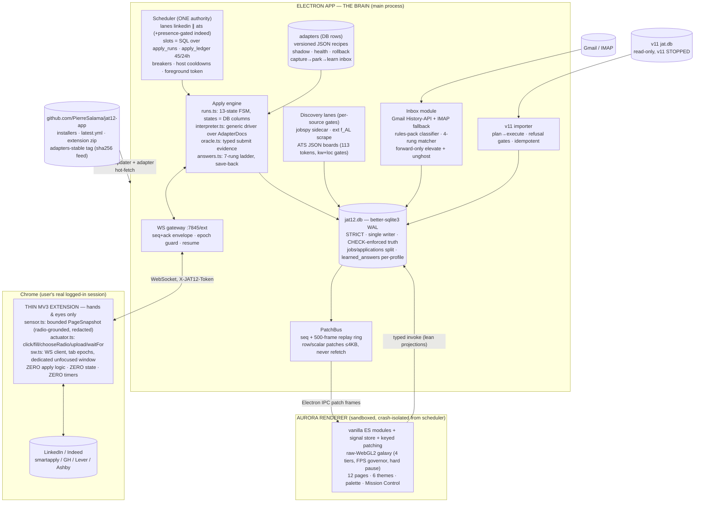

# JAT v12 — Master Plan (Pillar 0)

**Status:** APPROVED ARCHITECTURE — this document reconciles and supersedes the seven pillar docs where they conflict.
**Date:** 2026-07-07
**Author:** Chief architect
**Inputs:** `01-requirements.md` … `07-infra-test-release.md` (read in full), v11 ground truth (v11.27→v11.86 production saga, 16 memory files, 12-agent capability audit, 2026-07-03 vault decisions).

**Normative precedence:** each pillar doc remains the detailed spec for its domain. Where two pillars disagree, **§2 of this document is the ruling** and the losing text is amended (amendments enumerated in §2.1). Requirement IDs (R1–R35, F1–F21, N1–N23, NG1–NG10) from Pillar 1 remain the acceptance authority; where this plan renames a mechanism (e.g. SSE → PatchBus), the requirement's intent and its `AT-*` tests carry over unchanged.

---

## 1. The system on one page

**What v12 is:** a desktop Electron app (**the app brain**) that owns every piece of intelligence — scheduler, apply-run state machine, site adapters, answer ladder, discovery lanes, Gmail pipeline, SQLite store — driving a **thin Chrome MV3 extension** that is nothing but hands and eyes (DOM snapshots up, idempotent commands down) riding the user's real logged-in sessions. Site knowledge is **versioned JSON data** interpreted by one generic driver, hot-updatable without shipping code. The UI is the full **Aurora** experience, rendered only in the desktop app. v11's data arrives via a one-time read-only **importer**. Every v11 production failure is encoded as a structural impossibility (schema CHECKs, single-authority modules, build gates) — never as a convention.

**The eight structural laws** (each kills a v11 production failure class by construction):

| # | Law | Mechanism |
|---|---|---|
| 1 | The page never thinks | Extension is stateless sensor/actuator; app-owned 13-state FSM persisted per step; any death = resume-by-reclassification, never restart (R1–R4) |
| 2 | Site knowledge is data | Versioned JSON AdapterDocs classified over snapshot roles/names (never CSS classes); hot-reload, shadow, health auto-rollback; unknown pages capture-and-park into a learning inbox (R5–R10) |
| 3 | Busy = one SQL query | Slots are `apply_runs` rows in slot-holding states; tabs are never slots; ALL pacing in `scheduler.ts`; focus only via the single arbiter token (R11–R16) |
| 4 | Supply lanes are independent | Per-source refill gates read only their own queue; telemetry rows only on yield (CHECK-enforced); retention in the DDL (R17–R22) |
| 5 | One writer, honest truth | better-sqlite3 WAL, main-process-only; `submitted` requires trustworthy typed evidence **by CHECK constraint**; heavy text quarantined in side tables (R23–R24, F7) |
| 6 | Push is a patch | PatchBus: seq-numbered row/scalar frames ≤4KB with a replay ring; a collection refetch on push does not exist in the vocabulary (R25–R27) |
| 7 | Humans solve walls | ≤12s self-clear + ~30s presence probe + ≤60s unattended park + host cooldown; never solve, never focus-steal, never beep-loop (R28–R32) |
| 8 | Tokens rot, releases don't | Token health state machines + one-click re-auth + IMAP fallback; unpacked extension + tokenless public-repo updater; PROTOCOL_VERSION handshake makes skew visible (R33–R35) |

---

## 2. Reconciliation

### 2.1 Conflicts between pillars — resolved

| # | Conflict | Ruling | Rationale + required amendments |
|---|---|---|---|
| C1 | **Renderer framework:** Svelte 5 + Vite 8 (P2 §6) vs framework-free vanilla + signal store (P6 §1.1) | **P6 wins: vanilla ES modules + ~200-line signal store, esbuild-bundled.** | The lost Aurora proved the pattern at 42k LOC; P6's budgets (<2s interactive, 400KB gz) are CI gates a framework taxes; P7's toolchain is already esbuild-everywhere; one bundler, zero framework rot. *Amend P2 §6: drop `svelte`, `vite`, `@sveltejs/vite-plugin-svelte`, `svelte-check` from the manifest.* |
| C2 | **Galaxy:** three.js 0.185 + UnrealBloomPass (P2) vs raw WebGL2 (P6 §1.3, OQ-1) | **P6 wins: raw WebGL2**, one instanced draw call, all motion in the vertex shader. | ~150KB gz saved to render one draw call; P6's 4-tier/FPS-governor design is written against raw GL. OQ-1's second half is confirmed in scope: main forwards `BrowserWindow` show/hide/occlusion over IPC as a `win.visibility` patch frame. *Amend P2: drop `three`, `@types/three`. Amend P7 §4.2: renderer bundle note no longer mentions Three.js.* |
| C3 | **Renderer push:** "SSE dropped, IPC only" (P2 §8) vs "SSE + Last-Event-ID + 500-event ring" (P6 §6.2, OQ-4) vs `GET /api/events` SSE (P3 §9) | **One main-process PatchBus** (seq-numbered frames, 500-frame replay ring, ≤4KB, coalesced ≤1/entity/250ms). **Renderer subscribes over Electron IPC** (`patch` channel + `resume(lastSeq)` invoke). **No HTTP SSE endpoint at launch** (may return in 12.1 for sibling apps). Extension keeps its own WS `/drive` stream. | Same semantics everyone specced, one transport per consumer. P6's `sse.js` is renamed `patchbus.js` with identical rules (store.patch is the only mutation path, eslint fetch-ban). P1's R26/N7 and P5's "SSE patches" are globally renamed **push-patch**; intent and AT tests unchanged. *Amend P3 §9 + P5 §10: event tables become PatchBus vocabulary; P6 §6.2: EventSource → IPC client.* |
| C4 | **Repo name/case:** `JAT12-app` (P2) vs `jat12-app` public (P7 D1) | **`PierreSalama/jat12-app`, public.** | Matches the reserved userData identity; public is required for tokenless electron-updater + raw adapter fetches; PII stays out via synthetic importer fixtures (P7 D11) and the secrets-never-exported rule (P4). Pierre confirms/creates it (Q1). productName **"JAT Aurora"**, artifact `JAT12-setup.exe`, appId `com.pierre.jat12`. |
| C5 | **Run-state vocabulary + engine style:** XState v5 actors with persisted snapshots (P2 §5) vs hand-rolled FSM with states as DB columns and resume-by-reclassification (P3 §2) | **P3 wins: hand-rolled explicit FSM; XState is dropped from the manifest.** | The DB-visible state IS the architecture: slot accounting is one SQL query over `state`, TTL reclaim reads columns, and the resume invariant forbids replaying a stale machine snapshot — "the classifier is the only source of position." A second in-memory statechart representation would be a dual-authority bug farm. P2's actual goals (resume-not-restart, first-class timeouts, Mission Control introspection) are all delivered by P3's persisted rows + watchdogs + step records, unit-tested as a plain transition table (P7 §6.1). *Amend P2 §5: delete xstate; `apply_sessions` table is superseded by P4/P3's merged `apply_runs`.* |
| C6 | **`apply_runs` DDL divergence:** P3 §2.3 (13 states, engine columns) vs P4 §2.4 (8 coarse states, applications link, evidence CHECK) | **Merged table, P4 shape + P3 vocabulary.** Columns: P4's (`application_id` FK, `job_id`/`profile_id` denorm, `route`, `park_kind`, `evidence_kind` CHECK, timings) **plus** P3's engine columns (`lane`, `page_key`, `step_seq`, `resume_count`, `tab_epoch`, `cmd_seq`, `adapter_id/ver`). State CHECK = **P3's 13 states** (`queued, leased, navigating, classifying, driving, verifying, waiting_page, needs_human, submitted, ready_for_review, parked, skipped, failed`). Evidence CHECK becomes `state <> 'submitted' OR evidence_kind trustworthy`. SLOT_HOLDING = P3's six. | P4 owns table shape (jobs/applications split needs `application_id`); P3 owns engine semantics (slot query, `waiting_page` 120s TTL, `needs_human` releases the slot). Importer state map targets the merged vocabulary (`done`→`submitted` iff trustworthy). P1 F6's coarser state list is superseded; AT-R11/R12 unchanged. |
| C7 | **`apply_run_steps`:** P3 (kind vocab, 8KB detail, snapshot_hash) vs P4 (phase vocab, 1KB detail, 500-row trigger cap, 14d retention) | **P4's bounds win** (1KB detail, 500-row cap, WITHOUT ROWID, 14d retention — supersedes P3's 3d); **keep P3's `snapshot_hash`** column; phase vocabulary = P4's + `classify`/`resume`. Big captures live in `adapter_captures` (128KB, own table), never in steps. | Steps stay lean by DDL; evidence-grade blobs have their own quarantine table. |
| C8 | **Application status names:** v11 names verbatim (P5 §8.1, P6 §5.1: `started`, `contacted`) vs renamed (P4 §2.3: `tracked`, `acknowledged`) | **P4 wins — canonical names are the schema's** (`tracked`, `submitted`, `acknowledged`, `assessment`, `interview_1/2/final`, `offer`, `hired`, `rejected`, `withdrawn`, `ghosted`). Importer translates v11 names; P5's elevate ladder and P6's pipeline consume the generated contract. | One vocabulary, generated: `shared/contracts/status.json` holds application statuses (P4's 12), run states (P3's 13), park kinds, lane ids, PatchBus event names; `tools/gen-contracts.mjs` emits `fmt.status.js` (renderer), TS consts (main), and the zod enums (shared). Resolves P6 OQ-2. |
| C9 | **Emails DDL:** P4 §2.7 (epoch-ms INTEGER, 64KB body) vs P5 §2.2 (ISO TEXT timestamps, 8KB body, richer columns) | **P5's columns + P4's conventions.** Merged `emails`: P5 shape (`in_reply_to`, `ref_ids`, `classified_by`, `rules_pack_ver`, `ai_confidence`, `match_via`, `provider_msg_id`) with INTEGER epoch-ms timestamps, STRICT, body CHECK ≤ 8,000 chars (P5's deliberate cap; 90-day trim to 1,000 stands). `email_accounts` + `email_account_secrets` (P5) are kept as dedicated tables; P4's `secrets` table holds app-wide singletons (AI key, pairing token, CWS). | P4 owns repo-wide conventions; P5 owns email semantics. Importer converts ISO→epoch-ms. |
| C10 | **Discovery telemetry tables:** P4 §2.8 (`discovery_batches` CHECK + ring, `company_tokens`, `job_sightings`) vs P3 §7 (`discovery_batches` variant, `ats_companies`) | **P4's DDL is canonical** (CHECK `status<>'ok' OR found_count>0`, 5000-row ring, PK-deduped `job_sightings`); add P3's `lane` column. **`company_tokens` is the one ATS-seed table** (P3's `ats_companies` fields `consecutive_empty/consecutive_error` fold into `dead_count` semantics). Cursors live in `discovery_sources.cursor_json` (P4) — P3's `kv.discoverCursor` reference is amended. | One name per concept; the structural guarantees (yield-only, O(jobs) provenance) are P4's CHECKs, the write rules are P3's DAL behavior. |
| C11 | **IMAP libraries:** dropped (P2 §9 "one email path") vs required for the rot-proof fallback (P5 §3.4) | **P5 wins: `imapflow` + `mailparser` return to the manifest**, behind the single `InboxService` interface. | Token rot is ground-truth failure #8; the never-rots path earns its two deps. "One email path" becomes "one interface, two fetch providers." *Amend P2 §9 + §12.* |
| C12 | **Adapter validation lib:** ajv (P3 §4.1 lint.ts) vs zod (P2/P7 `shared/adapter-schema`) | **zod everywhere; ajv dropped.** `lint.ts` = zod parse + semantic checks (step graph closed, finalLabels ⊆ labels, oracles non-empty). | One validation library across wire protocol, recipes, DTOs, rows. |
| C13 | **Remote adapter feed URL:** `Job-ext-app` raw main (P3 §4.2) vs `jat12-app` `adapters-stable` tag + sha256 index (P7 §9) | **P7 wins.** Fetch `raw.githubusercontent.com/PierreSalama/jat12-app/adapters-stable/adapters/index.json`, sha256-verified, schemaVersion-gated, 6-hourly. | P3's text predates P7's channel design; the moving tag is invisible to electron-updater. *Amend P3 §4.2.* |
| C14 | **Monorepo layout:** `packages/shared` + `apps/desktop|extension` (P2 §1) vs flat `app/ extension/ shared/ adapters/ tools/ tests/` (P7 §3) | **P7 wins** — its tree is what the CI YAML and scripts are written against. Workspace package name stays `@jat12/shared`. Renderer lives at `app/src/renderer/` (P6's tree maps under it). Recipes live in `adapters/` (not P2's `recipes/`). Normalizers (`normKey/normJobUrl/normQuestion`) move from P4's `app/src/shared/` into `shared/` so app + extension + importer share one module. | Infra pillar owns the tree. |
| C15 | **Migration packaging:** one big `001_init.sql` (P4 §2) vs milestone-staged | **Staged migrations, forward-only:** `001-core` (M0), `002-discovery` (M2), `003-inbox` (M5), `004-fts` (M6). Pre-12.0.0 installs don't exist, so no consolidation is needed; `dump-schema.mjs` snapshots at each release. | Lets the walking skeleton ship on a quarter of the DDL; consistent with additive-within-MINOR (P7 D10). |
| C16 | **Payload-gate surfaces:** P6 asserts REST caps, but the renderer now rides IPC | **Caps re-target to where bytes actually travel:** DAL lean projections (asserted at the invoke-handler layer against the seeded 5k-job DB), IPC patch frames (<4KB), and the REST routes that remain (extension + tools). Numbers unchanged (`jobs?limit=100` <64KB, overview <16KB). | `ui-payloads.test.mjs` calls the same handler functions both transports share. |
| C17 | **P1 wording drift:** F20 names Job-ext-app-pattern repo; R15 pacing-config versioning; F6 state list; "SSE" throughout | Superseded respectively by: D1/C4 (jat12-app), P4's per-key `schema_version` settings registry (satisfies AT-R15c), C6's merged states, C3's PatchBus rename. Requirement intent + AT tests unchanged. | Keeps Pillar 1 as the stable acceptance authority without a rewrite. |
| C18 | **Retention numbers scatter** (P1 R19 vs P3 §2.3 vs P4 §2.11 vs P5 §11) | **Final table:** steps of terminal runs 14d (500-row cap always); `apply_runs` rows permanent-lean (evidence_json nulled at 14d); ledger 30d; discovery_batches ring 5000 + 5d; activity_log ring 20k; ai_calls ring 2000; emails unmatched 365d, matched-body trim at 90d; inbox_sync_runs 30d; events durable (4KB cap); backups daily keep 14; VACUUM every 3d; `wal_checkpoint(TRUNCATE)` on quit. | One list to implement in `maintenance()`; P1 R19's "transcripts 3d" is moot (transcripts don't exist in v12). |

### 2.2 Pillar open questions — decided by the architect

| Q (source) | Decision |
|---|---|
| Adapter distribution to Dad (P1-2) | **In scope at launch** via the `adapters-stable` channel (P7 §9) — it's already built into CI. Pierre's primary hotfix path stays local edit + `PUT /api/adapters/:id`. |
| Learned-adapter depth (P1-3) | **Human-approved drafts only** at launch (AI drafts → `draft` → shadow → manual promote). Auto-promotion after N clean shadow runs is a post-launch experiment flag. |
| Multi-account LinkedIn (P1-4) | **Out of scope** (ToS risk; NG stands). `apply_ledger.account_key` future-proofs the schema at zero cost. |
| Salary questions (P1-6) | **Split rule:** salary *history* = sensitive → always park (SENSITIVE_RX). Salary *expectation* = grounded rule answering from a user-configured range in the profile; **no range configured → park**. Never harvested into memory. |
| jobspy packaging (P1-7) | **Keep the pyinstaller onefile sidecar** (P7 release.yml step exists). Dev mode runs system python directly. Re-pin `python-jobspy`/`pyinstaller` at M4. |
| Aurora fallback for Dad (P1-8) | **FPS governor + heuristic initial tier** (P6 §4.4), no GPU blocklist. Dad's default = `Auto` (governor settles at tier 0/1); tier 0 is the static-gradient fallback. |
| Ollama default model (P2-3) | Docs/first-run suggest **`llama3.1:8b-instruct`** (any tag works; docs-only). |
| CWS listing (P2-4) | **New listing, reused publisher account.** Forced by coexistence: publishing the thin v12 extension to the v11 listing would auto-update and break Dad's live v11 mid-trial. Pairing doesn't depend on the extension ID (clean-machine audit). |
| uPlot (P2-5) | Hand-rolled canvas kit at launch; uPlot stays a pre-approved escape hatch, not shipped. |
| ATS background-tab viability (P3-1) | **Validate in M4 week 1** with live canaries. If hydration needs visibility, `ats.needsForeground=true` joins the token pool — a config flip, no redesign. |
| Remote adapter signing (P3-2, P7-3) | **HTTPS + sha256 index from our own repo is sufficient.** Threat model: a compromised GitHub account could already ship a malicious auto-updating app release — adapter signing adds no new trust root. ed25519 deferred. |
| EEO consent UX (P3-3) | **Default = park** (never auto-answer). One Settings card: `Demographic questions: Park (default) / Answer "prefer not to say" / Answer from my saved values`. Copy drafted at M3; runtime-flippable, not a plan blocker. Never harvested regardless. |
| LinkedIn budget 45 vs 50 (P3-4) | **Ship 45.** Revisit from `apply_ledger` percentiles after 2 weeks live. |
| Redactor fuzz (P3-5) | Added to M7 hardening: fuzz corpus over sensitive-label variants ("expected salary", "salary expectations", FR/ES forms) gates the release. |
| `answers_json` snapshot (P4-1) | **Keep** the 32KB per-application snapshot — audit of what was actually submitted beats normalization; the cap bounds it. |
| FTS5 (P4-2) | **Launch** (migration `004-fts`, M6) — the command palette needs it, cost is trivial. |
| v11 `punishments` (P4-3) | **Import.** New `blocklist` table (`company_key`, `title_rx`, `reason`, `created_at`) consumed by discovery gates + `rankJob`; importer maps v11 punishments into it. |
| Document blob cap (P4-4) | 25MB in-DB stands. Content-addressed file-store escape hatch documented; trigger = first real >25MB file. |
| Profile deletion (P4-5) | Typed-confirm modal + automatic `backupNow('pre-profile-delete')`; `deleteProfile` DAL ships with the M6 danger zone, not before. |
| Family email default (P5-1) | **IMAP app-password is the recommended default for family installs** (never rots; v11-proven with Dad); Gmail OAuth is the power-user path with the day-5 renew ritual. First-run wizard orders IMAP first on non-dev machines. |
| Emails `profile_id` (P5-3) | **No profile_id column on emails.** Attribution derives via `email_matches → applications.profile_id`; rungs 1–2 (thread, ATS-id) are profile-safe; the rung-3 candidate set is per-application (UNIQUE(job_id, profile_id)). Revisit only on an observed cross-link. |
| Outlook Graph (P5-4) | **Out of launch scope** — IMAP covers Outlook. |
| Digests (P5-5) | Ship behind a toggle, **default OFF** (never validated as wanted; quiet-by-default policy). |
| Galaxy occlusion IPC (P6 OQ-1b) | Confirmed: main forwards `show/hide/occlusion` as `win.visibility` patch frames; `galaxy.pause()` on hidden/occluded. |
| PatchBus vocabulary (P6 OQ-2) | Ratified = P6 §6.3 names, with P3 §9 mapped in (`discovery.batch`→`discovery.yield`, `needs_human`→`needsyou.added`, run patches split `run.lane`/`run.worker`). Lives in `shared/contracts/`, generated both ways. |
| Adapters page read-only (P6 OQ-3) | **Yes at launch** (read-only + rollback + health). Recipe editing = file/API for Pierre; in-app editor post-launch. |
| Replay ring in scope (P6 OQ-4) | **Yes** — the 500-frame ring is the PatchBus core (M2). |
| Light-theme galaxy (P6 OQ-5) | Light themes ship **galaxy-off-by-default** (tier-0 gradient); silver-mist shader stays in as opt-in; art sign-off happens when M6 renders it. |
| Playwright/MV3 pin (P7-1) | Pin the working Playwright/Chromium pair during M0; xvfb-run fallback designed in. |
| Coverage thresholds (P7-5) | None at 12.0; revisit at 12.1. |

### 2.3 The three questions that genuinely need Pierre

1. **Create the release repo (5 minutes, blocks CI + first installer).** Confirm the name **`PierreSalama/jat12-app`** (public) and create it empty. The name bakes into the electron-updater feed URL and the adapter hot-fetch URL — changing it after the first installer means orphaned installs. If you prefer different casing/naming, say so *before* M0 completes.
2. **Cutover mode when v12 is ready to drive.** **(A) Hard cutover (recommended):** freeze v11 → import → v12 drives all lanes → v11 parked-but-installed for 2 weeks (P7 §12 runbook as written; ~1 day of reduced throughput risk while v12 ramps). **(B) Phased per-source handoff:** v12 drives only the ATS lane for week 1 while v11 keeps LinkedIn/Indeed; requires building a small `--refresh-statuses` importer flag (forward-only status refresh onto rows untouched in v12) to merge v11's tail at final cutover; never two drivers *per source*. A is simpler and the runbook is already written; B keeps v11's LinkedIn volume during stabilization. Default = **A** if no answer by M7.
3. **AI-fallback default for first-run.** Both adapters ship (Anthropic API key + local Ollama); with neither configured the ladder parks instead of calling AI (safe). Which should the first-run card *recommend*: **Anthropic key** (better answers, ~cents/day, cloud) or **Ollama** (free, private, weaker on nuanced screening questions)? This also sets what we document for Dad's machine.

---

## 3. Build order — M0…M7

A **build-session** = one focused working session (~half a day of Pierre + Claude). Each milestone ends with a **provable checkpoint Pierre can watch run**. The walking skeleton rule: a real end-to-end LinkedIn apply lands at the end of M1 — ~10 sessions in — before any breadth or polish.

---

### M0 — Repo bootstrap + contracts + DB core (3 sessions)

**Goal:** a green-CI monorepo where the app boots, migrates, and answers `/health`.

**Deliverables & file scope**
- Repo per P7 §3: root `package.json` (workspaces, THE version), `tsconfig.base.json`, `.github/workflows/ci.yml`, `tools/{build,stamp-version,validate-versions,validate-extension,validate-adapters}.mjs`, `npm run dev` on the dev identity (port 7846, `jat12-app-dev`).
- `shared/`: `protocol/` (envelope types, `PROTOCOL_VERSION=1`), `adapter-schema/` (zod), `contracts/status.json` + `tools/gen-contracts.mjs`, `constants.ts`, normalizers (`normKey/normJobUrl/normQuestion` ported v11-identical).
- `app/src/main/db/`: better-sqlite3 open (pragmas per P4 §1.2), migration framework (P4 §3), **migration 001-core**: profiles, jobs, job_details, applications, apply_runs (merged C6 DDL), apply_run_steps (C7), learned_answers, documents(+blobs/text), adapters, adapter_health, adapter_captures, apply_ledger, lane_state, host_cooldowns, events, activity_log, ai_calls, settings, secrets, kv, import_runs, schema_migrations, blocklist.
- `app/src/main/server/`: Hono on 127.0.0.1:7845, `X-JAT12-Token` pairing, `GET /health` (versions, protocol, DB size).
- PatchBus core module (frames, seq; ring lands M2). Electron shell opens a blank window.
- Pin Playwright/Chromium pair for MV3 (P7 OQ-1).

**Tests that must pass:** `db-schema.test` (every CHECK fires: zero-yield batch, submitted-without-evidence, step-501, oversized JSON), `db-migrate.test` (fresh init, forward-only refusal, backup-before-migrate, failed-migration rollback→read-only), gates (`validate-versions --check`, extension/adapter validators), typecheck — all under `npm test` glob in CI.

**Provable checkpoint:** CI green on the new repo; `npm run dev` boots the app; `curl 127.0.0.1:7846/health` returns version+protocol; the migration test prints the schema snapshot.

---

### M1 — Walking skeleton: one real LinkedIn Easy Apply, end-to-end (7 sessions)

**Goal:** v12 submits a real LinkedIn Easy Apply from a pasted URL, and survives an extension kill mid-run. **This is the milestone that retires the architecture risk.**

**Deliverables & file scope**
- `extension/src/`: `sw.ts` (WS client, reconnect + `chrome.alarms` watchdog, tab registry, dedicated unfocused window, epochs), `content/sensor.ts` (PageSnapshot per P3 §3.3: 128KB/400-node cap, hidden-input grounding, group-prompt resolver, loading-label flag, redaction), `content/actuator.ts` (click/fill/chooseRadio/selectOption/combobox/upload/waitFor/scroll, stale-epoch refusal, post-mutation snapshot), popup (pairing status). Loads unpacked from `extension/dist`.
- `app/src/main/engine/`: `gateway.ts` (WS `/ext`, seq+ack, hello reconciliation), `runs.ts` (13-state FSM + watchdog timers per P3 §2.2), `classify.ts`, `interpreter.ts` (generic loop §4.3 incl. `normalizeLabel`/`stripLoadingPrefix`, disabled-is-waiting, repeat-action breaker, form-root re-derivation), `oracle.ts` (typed evidence, verified/grounded/inferred), `answers.ts` rungs 1/2/4/5 (sensitive short-circuit, memory exact, structured profile, grounded rules) with batched park.
- `adapters/linkedin-easyapply.json` exactly per P3 §4.5 (modal + full-page, opener/advance split, external fast-skip).
- Dev trigger: `POST /api/dev/apply {url, profileId}` + a bare button. Minimal profile editor seed (JSON file or SQL seed is fine at M1).
- `tests/replay/` harness v0: FakeTransport + first recorded transcript; `tools/record-transcript.mjs`.

**Tests:** AT-R1 (kill extension at step 3 → resume ≤5s, no re-click of the opener, completes to submitted — fault-injected via FakeTransport `evictWorker()` + live manual), AT-R2a/b (commandId dedupe, lost-ack retry), AT-R7 (Loading…Continue = present-and-waiting), AT-R8a (radios-only grounding), stale-epoch rejection, interpreter unit table over the linkedin fixture snapshots.

**Provable checkpoint (watch it):** Pierre pastes a LinkedIn job URL → v12 opens the tab in the unfocused apply window, fills, answers a work-auth radio deterministically, submits, and the DB shows `apply_runs` at `submitted` with `verified` evidence. Then: `chrome.runtime.reload()` mid-run → Mission-Control-less console shows `waiting_page` → run **resumes at the same step** and completes. AT-R1, live.

---

### M2 — Scheduler, lanes, volume + the answer loop (6 sessions)

**Goal:** unattended LinkedIn bursts at honest throughput, with the ask-once-ever loop closed.

**Deliverables & file scope**
- `engine/scheduler.ts`: lanes per P3 §5 (LANE_DEFAULTS), slot query (the ONE definition of busy), start-based pacing + jitter, `apply_ledger` rolling 45/24h, hourly/daily caps, breakers + host cooldowns, foreground-token arbiter, presence gate, event-driven pump + 15s backstop, reclaim watchdogs (waiting_page 120s TTL).
- **Migration 002-discovery**: discovery_sources, company_tokens, discovery_batches (CHECK+ring), job_sightings. `discovery/`: `lanes.ts` (per-lane refill gates), `jobspy.ts` (system-python dev mode, combo cursor in `cursor_json`, freshness ramp + saturation jump), `ext f_AL scrape` lane via the command protocol.
- `answers.ts` complete: fuzzy rung (Jaccard 0.85 over per-run snapshot), AI rung (both fetch adapters, `aiAnswerConfidenceMin` 0.65, settings-gated, parks when unconfigured), save-back (`needs-you` answer → memory → re-queue front-of-lane), AI-harvest-on-submit at 0.9.
- PatchBus replay ring (500 frames) + `resume(lastSeq)`; REST for needs-you (`GET /api/needs-you`, `POST /api/runs/:id/answer`) + a plain dev list page.
- `croner` scheduler module owning all periodic work (maintenance(), lane backstops).

**Tests:** AT-R11 (warm tab ≠ slot: dispatch ≤5s), AT-R12 (reclaim ≤2min), AT-R13a (arbiter: 6 requests → 1 grant), AT-R15a (51st LinkedIn dispatch deferred `account_cap`), AT-R15b grep-gate, pacing property test (parallelism can never exceed the ledger budget), AT-F9b (park → answer → same question never parks again), AT-R20 (cursor survives restart), yield-only telemetry (100 empty scans → 0 rows).

**Provable checkpoint:** a supervised 2-hour LinkedIn burst on fresh supply: **≥25 dispatches/hr, median gap ≤2min**, ledger visibly capping, zero focus steals; Pierre answers 3 parked questions in the dev list and re-runs — all three auto-answer from memory (asked-once-ever, live).

---

### M3 — Aurora shell + Mission Control + Needs-You + Applications (8 sessions)

**Goal:** the engine becomes watchable and drivable in the real UI; the daily-driver loop moves into v12.

**Deliverables & file scope**
- `app/src/renderer/lib/`: signal.js, dom.js, list.js, vlist.js, router.js, store.js (patch-only mutation), api.js (typed invoke), patchbus.js (IPC client + resume), fmt.js + generated fmt.status.js, toast/modal/drawer/palette shells.
- Shell per P6 §2 (`.shell` contract + layout test), tokens/themes.css (aurora + arctic-light first), glass system + backdrop budget lint, galaxy tier 0/1 only (static gradient + basic instanced field; full governor in M6).
- Pages: **Mission Control** (KPI strip + cap ring, LaneCards, WorkerCards with step tracker + snapshot ticker, breaker board, event ticker, engine-truth-only run switches), **Needs-You** (keyboard j/k/Enter answer-to-memory, captcha/login honest parks with open-tab), **Applications** (VirtualList + lean projection + fetch-on-open drawer + stale pill), **Settings v0** (Tokens & Connections card scaffold, AI provider picker, EEO defaults card, lane caps mirror, theme picker).
- CI gates live: `ui-payloads.test.mjs` (seeded 5k jobs; C16 surfaces), `perf-boot.test.mjs` (<2s interactive), eslint fetch-ban outside api.js, layout-classes test.

**Tests:** store patch semantics (SSE-storm regression: 100 patches → zero collection refetches, network log assert), vlist windowing, palette registry, AT-F15 (kill renderer during 3 in-flight runs → all complete, reopened window truthful), payload caps, keyed-list focus guard.

**Provable checkpoint:** Pierre runs a live burst **watching Mission Control**: worker cards tick real steps with the sensor's snapshot summaries; he kills the extension → card shows `waiting_page` → resume; he clears the needs-you queue hands-on-keyboard; cap ring fills toward 45. Theme switch recolors everything live.

---

### M4 — Source breadth: Indeed + ATS boards + adapter lifecycle (8 sessions)

**Goal:** all launch sources apply for real; DOM breaks become recipe edits.

**Deliverables & file scope**
- `adapters/indeed-smartapply.json` per P3 §4.6 (indeed_native routing, Loading…Continue, `/post-apply` verified + smartapply-host grounded oracles, CF humanGate, external fast-skip); HumanGate flow per P3 §6 (12s self-clear, 30s presence probe, ≤60s unattended park, host cooldown, attended re-queue front-of-lane, cf_clearance warm-tab economics, presence-gated lane).
- `discovery/ats-boards.ts`: GH/Lever/Ashby pollers over `company_tokens` (113 seeds shipped as data), keyword+location positive gates + funnel counters, token health auto-retire, auto-candidate tokens from seen URLs; `blocklist` consumed by gates + rankJob.
- `adapters/{greenhouse,lever,ashby}.json` + `walls.json` (Workday/iCIMS/Taleo park-by-design, BambooHR fill-then-park honeypot rule) + `generic-fallback.json`.
- Adapter lifecycle: registry hot-reload (`PUT /api/adapters/:id`, next-lease pickup), shadow validation + divergence log, health auto-rollback, capture-and-park → adapter inbox (`GET /api/captures`, AI draft endpoint), `adapters.yml` CI channel + `adapters-stable` tag + client fetch/verify.
- **Background-ATS validation (week-1 task):** drive GH/Lever/Ashby from background tabs live; flip `ats.needsForeground` if hydration fails.
- Discovery page + Adapters cockpit page (read-only + rollback). `tools/canary.mjs` + `--i-am-watching`.
- Browser-replay tier: fixture server under real hostnames, capture-fixture tool, launch fixture set (P7 §6.4 list).

**Tests:** `ats-starves-linkedin` regression fixture (AT-R17), AT-R18 (yield-only), AT-R21 (Canada gate funnel fixture), AT-R29/R30a-c (badge ≠ challenge; unattended ≤60s park + breaker; attended never reaped), AT-R32 (walls: one click, one park), AT-R5/R6 (hot update no-restart; rollback byte-identical), AT-R9/R10 (form-root swap survives; unknown ATS → one capture+park, zero retries), adapter lint gate (every builtin has ≥1 replay fixture per form/review/confirmation page).

**Provable checkpoint:** one **watched real apply on each** of Indeed, Greenhouse, Lever, Ashby via the canary tool with evidence bundles; a live Cloudflare hit parks in ≤60s with one OS notification and a visible breaker; the LinkedIn lane's throughput is unaffected while the ATS lane holds a 500-job backlog (starvation fixture, live); Pierre edits a label pattern via `PUT /adapters/:id` and the very next run uses it — no restart, no reload.

---

### M5 — Gmail/status pipeline + v11 import (8 sessions)

**Goal:** the inbox drives the funnel; Pierre's 4,153-job history lives in v12.

**Deliverables & file scope**
- **Migration 003-inbox** (merged C9 DDL). `app/src/main/inbox/` per P5 §1: accounts + safeStorage secrets, Gmail OAuth loopback + token state machine (day-5 amber, invalid_grant → expired, one-notification dedup), query-poll sync + per-message watermark commit, rules-pack interpreter + default pack + fixture corpus CI gate, matcher rungs 1–4 (thread, **ATS-external-id**, scorer, AI disambiguation ≤6) + auto-create orphans, `elevate.ts` (forward-only, idempotent-unconditional, terminal protection, unghost, single-transaction audit), History-API incremental + metadata prefilter, IMAP fallback port (imapflow/mailparser), reprocess + pack-upgrade hooks (broadened query → auto-backfill), notification policy table, coverage-gated ghost sweep.
- **Importer** per P4 §5: plan→execute, refusal gates (lock-dir, port-7744 probe), WAL-aware snapshot copy, feature-detected v11 user_version 6–15, full mapping table (incl. punishments→blocklist, evidence-trust quarantine, sensitive drops), idempotent ON-CONFLICT-DO-NOTHING, dry-run report UI wizard + `tools/import-v11.mjs` CLI, `import_runs` audit, post-import auto-reprocess. Synthetic v11-DDL fixture in CI + local `test:import:real`. (If Pierre picks cutover B: add `--refresh-statuses`.)
- Pages: **Emails** (matched feed + unmatched pane + loud token health header + reconnect), **Pipeline** kanban (P4 status vocabulary), **Profile & Memory** browser (verify imported 1,614 + 2,314 rows, unlearn affordance), Import wizard in Settings.

**Tests:** classifier regression corpus (CMiC receipt, neutral-subject rejection, neutral-subject invite, ceipal/workable, HackerRank, offer…), matcher units (ATS-id beats fuzzy; never-inherit-from-suggested; predates-apply negative), elevation property test (forward-only × terminal × rejection-exception × unghost × idempotent), token lifecycle simulation (fake clock), watermark crash-resume, `import-v11.test` (user_version 6/11/15 synthetic DBs, double-run = all skips, sensitive drops, evidence quarantine, merge_dedup), plan/execute parity test.

**Provable checkpoint:** importer dry-run against a **copy of the live jat.db** shows the count table (4,153 jobs / 483 submitted / 82 docs / 1,614+2,314 memory / 497 emails) → execute → re-run shows zero new rows; Pierre connects Gmail with one click, a real rejection email moves its pipeline card with an audit event; revoking the token turns the chip red with a working one-click re-auth; Dad-mode: the same wizard refuses politely while v11 runs.

---

### M6 — Aurora completeness: galaxy, analytics, palette, polish (6 sessions)

**Goal:** the full 12-page Aurora experience at 60fps, gates green.

**Deliverables & file scope**
- Galaxy full build (P6 §4): 4 quality tiers + FPS governor + persisted tier, submit **pulse** (uPulse ring), occlusion hard-pause via `win.visibility`, theme→shader palette bridge, light-theme silver-mist (opt-in; off-by-default on light themes), reduced-motion path.
- Remaining 4 themes; chart kit (funnel/sankey/heatmap/line/bars/donut + chart-core) + **Analytics** page (server-side aggregates); **Goals & Streaks** (streak grid, pace projection, goal pulse); **Documents** page; command palette complete + **migration 004-fts** (jobs_fts) for find-job; Adapters cockpit polish (health chips, early-warning topbar chip).
- `leak.test.mjs` (12 pages ×50 cycles under patch load), galaxy frame budget check, backdrop lint, theme-token lint, danger zone (typed-confirm wipe + profile delete with pre-backup).

**Tests:** all P6 §10 budgets as CI gates (boot <2s, JS <400KB gz, payload caps, leak plateau, zero >50ms long tasks on 5k-row scroll), charts unit tests, fts search test, contract-generation drift test.

**Provable checkpoint:** full 12-page walkthrough on Pierre's RTX 3080 at tier 3/60fps with pulses firing on live submits; the same build forced to tier 0 stays fully usable (Dad-class); `Ctrl+K` fuzzy-finds any of 4,153 jobs in <50ms; 1-hour patch-storm soak shows a flat heap.

---

### M7 — Release pipeline, soaks, cutover (6 sessions)

**Goal:** v12.0.0 ships from `jat12-app`, survives its soaks, and takes over from v11.

**Deliverables & file scope**
- `release.yml` (Windows must-pass matrix, conditional CSC_LINK, jobspy pyinstaller re-pinned, installer-presence tombstone gate, extension zip asset, SHA256SUMS), `release.ps1` (stamp → gates → checklist incl. canary freshness scan → tag → verify release contents; asserts origin == jat12-app), `rollback.ps1` (draft-hide + re-ship-higher-patch; `-AdaptersOnly` retag), `dump-schema.mjs` wired into release, electron-updater end-to-end (rc → final on a second install), auto-update idle-gate (AT-R35).
- Hardening: snapshot-redactor fuzz corpus, extension forbidden-pattern gate final (no non-localhost fetch, no eval, permission golden set), pairing-consent flow polish, `docs/{RELEASING,ROLLBACK,CUTOVER,EXTENSION-DEV}.md`.
- Soaks: **24h unattended ATS soak** (N2), 3h LinkedIn burst benchmark (N1), 7-day DB-growth monitor kicked off (<30MB, N11), nightly suite (payload sweep, soak fixtures).
- **Cutover execution** per P7 §12 and Pierre's Q2 answer: freeze v11 → final import → extension swap → canaries → conservative 48h → 2-week park (never-two-drivers rule). Dad prep: CWS private **new listing** submission with the release-asset zip; UI-only runbook variant.

**Tests:** the release checklist itself (canary ≤7d gate), AT-R33/R34 (token health + skew banner), AT-R35, migration stepwise tests over dumped schemas, `test:import:real` as the cutover verifier.

**Provable checkpoint:** tag `v12.0.0-rc` → CI → installer lands in the GitHub release with latest.yml + extension zip → a second machine/VM auto-updates rc→12.0.0; the 24h ATS soak report shows zero human interactions and zero starvation; cutover Phases 0–2 complete on Pierre's machine with v12 driving and v11 parked.

---

## 4. Risk register — top 10 (mitigations already designed in)

| # | Risk | Likelihood × impact | Mitigation (built into the plan) | Residual |
|---|---|---|---|---|
| 1 | **LinkedIn DOM drift** breaks the volume lane | Certain, eventually × High | Adapters-as-data: recipe edit + hot reload (AT-R5), `adapters-stable` feed to every machine in minutes, capture-and-park inbox turns breaks into authored recipes, shadow validation + health auto-rollback, fixture-per-incident law (N21) | A change breaking the *sensor* contract (roles/labels themselves) needs an extension reload — sensor stays site-agnostic to minimize this |
| 2 | **MV3 lifecycle** (SW eviction, port death, bfcache) corrupts runs | High × High | App-owned FSM, resume-by-reclassification, tab epochs + seq/ack idempotent commands, `waiting_page` 120s TTL, alarms watchdog; AT-R1/R3 fault injection in CI every push | Chrome behavior shifts are absorbed because eviction is treated as *normal*, not exceptional |
| 3 | **LinkedIn per-account cap / anti-bot escalation** | Medium × High | `apply_ledger` hard budget 45/24h (parallelism mathematically can't stack), start-based pacing + jitter, breaker on human walls, NO stealth/fingerprint evasion (policy), honest ceiling messaging (N4) | Account restriction remains possible; conservatism + instant breaker is the only honest defense |
| 4 | **Aurora scope weight** delays engine value | Medium × Medium | UI lands *after* the engine works (M1–M2 run headless), budgets are CI gates not aspirations, vanilla stack minimizes surface, galaxy isolated in `galaxy/` and off the apply-critical path (renderer crash never touches the scheduler — AT-F15) | M3+M6 = 14 sessions of UI; the walking skeleton is already delivering value while they run |
| 5 | **Import fidelity** (15 v11 migrations, Dad's older DB, PII) | Medium × High | Feature-detected columns (user_version 6–15), two-phase dry-run with per-section counts, idempotent re-runs, synthetic-DDL CI fixture + local `test:import:real` + cutover count verifier, refusal gates (lock dir, port 7744), evidence-trust quarantine | Unknown-newer v11 versions import the known-column subset with a warning |
| 6 | **Token rot** (Gmail 7-day, CWS) | Certain × Medium | Token state machine + day-5 proactive re-auth + OS notify, IMAP app-password fallback (family default — never rots), release path never touches CWS (unpacked primary; Actions `GITHUB_TOKEN` for installers), ghost sweep coverage-gated so a dead token can't mislabel jobs | Weekly OAuth ritual remains for Pierre if he stays on OAuth — by design |
| 7 | **Focus wars / background-ATS unknown** | Low × Catastrophic (froze the machine in v11) | Single app-side foreground token, ats lane background-only, indeed presence-gated, launch parallelism = linkedin ∥ ats only, `frontToHydrate` mechanisms build-gated out (AT-R13); background-ATS viability validated M4 week 1 with a config-flip fallback | If ATS needs visibility it joins the token pool — throughput dips, machine never freezes |
| 8 | **Cloudflare/human walls** burn unattended time | High × Medium | 12s self-clear + 30s presence probe + ≤60s unattended park (vs v11's 6min), host cooldown breaker, one-notification policy, presence-gated indeed lane, `awaitingHuman` overrides hard-caps (AT-R30a-c); never solve (build-gated, NG1) | Indeed stays a marginal, human-adjacent lane — priced into the honest ceiling |
| 9 | **Platform/release integrity:** better-sqlite3 ABI × Electron churn; a v12 tag force-upgrading Dad's v11 | Low × High | Exact Electron pin + paired better-sqlite3 bumps + CI Windows open/write/vacuum smoke + `@electron/rebuild` fallback; **new repo `jat12-app` is the only place v12 tags exist** (release.ps1 asserts the remote), v11's Job-ext-app machinery untouched during transition | WAL + single-writer already killed the wasm failure class outright |
| 10 | **Bloat regression** (payloads, junk telemetry, DB growth) | Medium × Medium | CHECK constraints (yield-only batches, evidence-required submits), ring triggers + 500-step cap, heavy text quarantined by table design, lean-projection shape tests, `ui-payloads` gates vs seeded 5k DB, retention table (§2.1 C18) in `maintenance()` from day one, 7-day <30MB soak (N11) | A regression fails the build, not Pierre's afternoon |

---

## 5. Effort summary & sequencing notes

| Milestone | Content | Sessions | Cumulative |
|---|---|---|---|
| M0 | Repo, contracts, DB core, CI | 3 | 3 |
| M1 | **Walking skeleton: real LinkedIn apply + resume** | 7 | **10** |
| M2 | Scheduler, lanes, ledger cap, answer loop | 6 | 16 |
| M3 | Aurora shell, Mission Control, Needs-You, Applications | 8 | 24 |
| M4 | Indeed + ATS adapters, discovery breadth, adapter lifecycle | 8 | 32 |
| M5 | Gmail pipeline + v11 import | 8 | 40 |
| M6 | Aurora completeness (galaxy, analytics, palette) | 6 | 46 |
| M7 | Release pipeline, soaks, cutover | 6 | **52** |

**~52 build-sessions total (±20%).** Sequencing rationale: the two genuinely novel risks — the thin-extension protocol surviving MV3 death, and adapter-driven applying — are both retired by session 10 (M1's checkpoint). Everything after is breadth on a proven spine. M3 lands before M4/M5 because watching the engine (Mission Control + Needs-You) makes every subsequent milestone's debugging observable instead of blind — the standing "never debug blindly" doctrine applied to the build itself. Each milestone leaves the app in a state Pierre can run daily; from M3 onward v12 can be his triage UI even while v11 still drives applies.

**Dependencies on Pierre:** Q1 (repo) before M0 completes; Q3 (AI default) before M2's first-run card is final (non-blocking — parks safely until configured); Q2 (cutover mode) before M7 Phase 2 (defaults to hard cutover).
