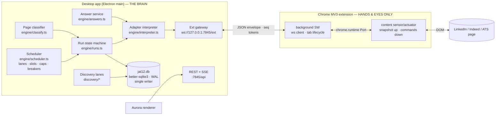
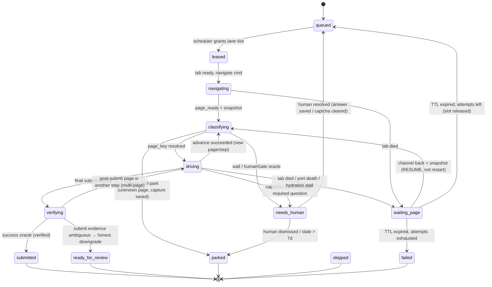

# JAT v12 — Pillar 3: The Apply Engine + Site-Adapters-as-Data

**Status:** design-complete, implementation-ready
**Owner:** app brain (`app/src/engine/*`), thin extension (`extension/*`)
**Depends on:** Pillar 1 (app core: better-sqlite3 DB, API server on 7845, X-JAT12-Token), Pillar 2 (profile/memory/documents), Pillar 4 (Aurora UI consumes the lean APIs + SSE patches defined here)
**Evidence base:** v11 source (`.v11-publish/`), memory files `reference_jat_v1181_v1182`, `reference_jat_pipeline_ceilings`, `reference_jat_autoapply_engine`, `reference_jat_external_ats`, `reference_jat_indeed_support`, `reference_linkedin_easyapply_fullpage`, `reference_jat_radio_grounding`, `reference_jat_discovery_supply`, `feedback_jat_parallel_freeze`, vault decision `2026-07-03 — jat-v12-sibling-coexistence-architecture`.

---

## 0. Design contract — the eight structural guarantees

Every one of these broke v11 in production. v12's engine is architected so the failure is **impossible by construction**, not patched-around:

| # | v11 failure | v12 structural guarantee |
|---|---|---|
| 1 | Brain-in-content-script (`executor.js` ~3.5k lines; MV3 SW eviction / port death / bfcache killed runs mid-flight) | **App owns the run state machine, persisted per step in SQLite.** The extension is a stateless sensor/actuator. A page or SW death transitions the run to `waiting_page`; reconnect **resumes** by re-classifying the live page. There is no state to lose in the browser. |
| 2 | Heuristic accretion (every LinkedIn DOM change = hand-patched regex in shipped code; "form disappeared after advancing" ×155/4h) | **Adapters are versioned JSON data**, interpreted by one generic driver. DOM change → edit a recipe row, hot-reload, no code ship. Unknown pages degrade to **capture-and-park** which feeds the learning loop. |
| 3 | Slot/pacing bugs (warm tab counted as busy slot = 8-min gaps; parallel windows froze the whole machine) | **Worker slots are counted ONLY from `apply_runs` rows in slot-holding states.** Tabs are never slots. All pacing/caps live in exactly one place: `engine/scheduler.ts`. Parallelism never requires OS focus; a single app-side **foreground token** arbiter makes a focus war impossible. |
| 4 | Discovery starvation + churn (shared refill gate → ATS backlog starved LinkedIn 30/hr→1.6/hr; 12.8k junk batch rows/day) | **Per-source supply lanes with per-lane refill gates.** A lane's gate reads only its own queue depth. Telemetry rows are written **only on yield** (found>0, rate-limit, or error). Retention/pruning is in the schema from day one. |
| 5 | node-sqlite3-wasm (mkdir-lock VFS, silent write drops, brick-on-crash) | **better-sqlite3, WAL, app main process is the only writer.** Extension and renderer go through the API. (Pillar 1; restated here because every engine table assumes it.) |
| 6 | Payload bombs (16MB `/jobs`, 17MB `/queue` on every SSE refetch) | **Lean list projections + detail-on-demand + row-level SSE patches** (`run.patch {id, ...changed}`) — the dashboard never refetches a collection because one row changed. |
| 7 | Cloudflare/human walls (6-min unattended waits, beep spam) | **HumanGate policy object**: never auto-solve; ~30s unattended probe; park `needs_human` releasing the slot immediately; host cooldown breaker; one OS notification with re-fire, no audio loops. Workday/iCIMS/Taleo park-by-design. |
| 8 | Token/auth rot | Engine has **zero rot-prone token dependencies**. The extension pairs once (consent click) and the token never expires by design; token health for Gmail/CWS is Pillar 1 UI. Extension delivery keeps the unpacked path first-class. |

---

## 1. Architecture overview



**Division of labor (hard rule):**

- The **extension** knows how to: open/close/navigate tabs in the dedicated apply window, take a `PageSnapshot`, execute a `Cmd`, report page events (navigation, dialog, unload), stream a file into an `<input type=file>`. It holds **no** apply logic, no selectors beyond the snapshot heuristics, no pacing, no answer logic, no adapter knowledge.
- The **app** knows everything else: which job to run, which adapter applies, what page we're on, what field gets what value, when to advance, when we succeeded, when to park, when to notify the human.

If a proposed feature requires the extension to "decide" anything about an application, the design is wrong — move it to the app and have the extension report the observation instead.

### 1.1 Module layout (app)

```
app/src/engine/
  scheduler.ts        // lanes, slots, pacing, caps, breakers, foreground token
  runs.ts             // apply-run state machine + persistence + watchdogs
  interpreter.ts      // generic adapter driver (pure-ish; DOM via protocol)
  classify.ts         // page classification against adapter PageDefs
  answers.ts          // screening-answer resolution ladder
  oracle.ts           // success/failure/human-gate evaluation
  protocol.ts         // envelope + Cmd/Event/Snapshot types, seq bookkeeping
  gateway.ts          // WebSocket server for the extension channel
  adapters/
    registry.ts       // load/validate/hot-reload adapter docs from DB
    lint.ts           // adapter schema validation (ajv) + semantic lint
    builtin/          // the shipped v1 adapter JSON (seeded into DB on boot)
      linkedin-easy-apply.json
      indeed-smartapply.json
      greenhouse-form.json
      lever-form.json
      ashby-form.json
      generic-fallback.json
      walls.json      // workday/icims/taleo/bamboohr park-by-design
  capture.ts          // unknown-page capture + learning pipeline
app/src/discovery/
  lanes.ts            // per-source supply lanes + refill gates
  jobspy.ts           // python jobspy runner (linkedin/indeed)
  ats-boards.ts       // Greenhouse/Lever/Ashby JSON pollers
  gates.ts            // keyword + location positive gates, freshness ramp
extension/
  sw/main.ts          // ws client, reconnect, tab registry, alarms watchdog
  sw/files.ts         // file fetch-from-app + chunk relay to content
  content/sensor.ts   // PageSnapshot builder (a11y-ish, size-bounded)
  content/actuator.ts // Cmd executors (click/fill/select/upload/scroll/waitFor)
  content/port.ts     // Port to SW, event forwarding, nid registry
```

---

## 2. The apply-run state machine (app-side)

### 2.1 States

```ts
export type RunState =
  // waiting
  | 'queued'          // eligible; waiting for a lane slot
  // slot-holding (these and ONLY these count toward lane in-flight)
  | 'leased'          // scheduler claimed a slot; tab being provisioned
  | 'navigating'      // navigate issued; waiting page_ready event
  | 'classifying'     // snapshot in hand; classifier resolving page_key
  | 'driving'         // interpreter executing the current page's actions
  | 'verifying'       // final submit issued; oracle evaluating evidence
  | 'waiting_page'    // channel/tab dead or page hydrating; resumable; TTL'd
  // parked (slot RELEASED — the human owns the next move)
  | 'needs_human'     // captcha / login / unanswerable question / verification
  // terminal
  | 'submitted'       // success oracle passed (verified evidence)
  | 'ready_for_review'// filled to the submit gate in review mode / CAPTCHA-gated fill
  | 'parked'          // honest structural park (account wall, resume missing…)
  | 'skipped'         // relevance/eligibility skip — never attempted
  | 'failed';         // exhausted retries on a transient failure

export const SLOT_HOLDING: RunState[] =
  ['leased','navigating','classifying','driving','verifying','waiting_page'];
export const TERMINAL: RunState[] =
  ['submitted','ready_for_review','parked','skipped','failed'];
```



**The resume invariant (guarantee #1):** every transition writes `apply_runs` inside the same better-sqlite3 transaction that records the step evidence. When the channel returns after any death, the app does **not** replay a script — it requests a fresh snapshot, re-classifies the live page against the adapter's `pages`, finds where we actually are (LinkedIn keeps your Easy Apply draft; the classifier will land on `form` step 2/4 if that's what's on screen), and continues from there. Blind re-issue of the last command is forbidden; the classifier is the only source of position.

### 2.2 Watchdogs (all app-side timers; the extension has none)

| State | Budget | On expiry |
|---|---|---|
| `leased` | 20s (tab provisioning) | retry tab create once → `waiting_page` |
| `navigating` | 45s | → `waiting_page` |
| `classifying` | 15s + one scroll-nudged re-snapshot | hydration wait path: up to 20s total (v11 lesson: always wait for hydration before deciding external/failure) → `waiting_page` |
| `driving` per-action | 10s default; `waitFor` up to adapter's `timeoutMs` (cap 30s) | action retry ×1 with fresh snapshot → step failure handling |
| `waiting_page` | **120s TTL** (v11.84: stranded `scheduled` reclaimed in 2min) | release slot; attempts<3 → `queued` (resume flag kept), else `failed` |
| whole run (hard cap) | 8 min | honest `failed: "run hard cap"` — **except** `needs_human` is NOT time-capped by the run (v11.73 lesson: the hard cap must never kill a human pause; `needs_human` released the slot already, so nothing is pinned) |

### 2.3 Run record schema (DDL)

```sql
CREATE TABLE apply_runs (
  id            TEXT PRIMARY KEY,          -- ulid
  job_id        TEXT NOT NULL REFERENCES jobs(id),
  profile_id    TEXT NOT NULL REFERENCES profiles(id),
  source        TEXT NOT NULL,             -- 'linkedin'|'indeed'|'greenhouse'|'lever'|'ashby'|'generic'
  lane          TEXT NOT NULL,             -- scheduler lane key (usually == source)
  adapter_id    TEXT,                      -- resolved adapter doc id
  adapter_ver   INTEGER,                   -- adapter version used (pins evidence)
  mode          TEXT NOT NULL DEFAULT 'auto',  -- 'auto'|'review'
  state         TEXT NOT NULL DEFAULT 'queued',
  page_key      TEXT,                      -- current adapter page key (resume anchor)
  step_seq      INTEGER NOT NULL DEFAULT 0,-- monotonically increasing step counter
  attempts      INTEGER NOT NULL DEFAULT 0,
  resume_count  INTEGER NOT NULL DEFAULT 0,
  tab_epoch     TEXT,                      -- current TabSession epoch (see §3.4)
  cmd_seq       INTEGER NOT NULL DEFAULT 0,-- last command seq issued for this run
  park_reason   TEXT,                      -- machine key: 'captcha'|'login'|'needs_answer'|'resume_required'|'account_wall'|'unknown_page'|...
  last_error    TEXT,
  outcome_evidence TEXT,                   -- JSON: oracle results incl. verification level
  pending_questions TEXT,                  -- JSON: [{qid, question, kind, options[]}] for needs-you UI
  created_at    INTEGER NOT NULL,
  scheduled_at  INTEGER,                   -- slot grant time (pacing anchor is START-based, v11 lesson)
  started_at    INTEGER,                   -- first navigate
  finished_at   INTEGER,
  updated_at    INTEGER NOT NULL
);
CREATE INDEX idx_runs_state       ON apply_runs(state, lane);
CREATE INDEX idx_runs_job         ON apply_runs(job_id);
CREATE INDEX idx_runs_updated     ON apply_runs(updated_at);

CREATE TABLE apply_run_steps (
  run_id       TEXT NOT NULL REFERENCES apply_runs(id) ON DELETE CASCADE,
  seq          INTEGER NOT NULL,           -- == apply_runs.step_seq at write time
  page_key     TEXT NOT NULL,
  kind         TEXT NOT NULL,              -- 'classify'|'fill'|'answer'|'upload'|'advance'|'submit'|'oracle'|'resume'|'park'|'error'
  detail       TEXT,                       -- JSON, size-capped 8KB (redacted; see §3.3 value policy)
  snapshot_hash TEXT,                      -- sha1 of the snapshot this step acted on
  started_at   INTEGER NOT NULL,
  finished_at  INTEGER,
  ok           INTEGER,                    -- 1/0/null(in-flight)
  PRIMARY KEY (run_id, seq)
);

-- Rolling-cap accounting: ONE row per real submit, per source/account. This is
-- the authority for the LinkedIn ~50/24h per-ACCOUNT cap (we budget 45).
CREATE TABLE apply_ledger (
  id           INTEGER PRIMARY KEY AUTOINCREMENT,
  run_id       TEXT NOT NULL,
  source       TEXT NOT NULL,
  account_key  TEXT NOT NULL DEFAULT 'default',  -- future multi-account
  submitted_at INTEGER NOT NULL
);
CREATE INDEX idx_ledger_window ON apply_ledger(source, account_key, submitted_at);
```

**Retention (in schema from day one — guarantee #4):** `apply_run_steps.detail` capped at 8KB per row on write; terminal runs keep steps 3 days then rows are pruned (`engine/maintenance.ts`, daily); `apply_runs` terminal rows keep 90 days lean (evidence JSON nulled after 14 days); `apply_ledger` keeps 30 days. VACUUM every 3 days if freelist > 10MB.

### 2.4 Evidence & submit truth (v11 false-submit + awaiting_review lessons)

`outcome_evidence` is a typed JSON:

```ts
interface OutcomeEvidence {
  verification: 'verified' | 'grounded' | 'inferred' | 'none';
  signals: Array<{
    oracleId: string;            // which adapter oracle fired
    kind: 'confirmation_text' | 'url' | 'form_gone' | 'toast' | 'email_later';
    value: string;               // e.g. matched text, matched URL
    at: number;
  }>;
}
```

Rules (encode v11.61/v11.66 truths):
- `submitted` requires `verification ∈ {verified, grounded}`. *Verified* = an explicit confirmation oracle matched (text/URL). *Grounded* = a host-level truth (e.g. landing on `smartapply.indeed.com/beta/indeedapply/form/post-apply` IS a submit; being on `smartapply.indeed.com` at all grounds the flow as apply-only).
- Ambiguous submit (form disappeared, no confirmation) → `ready_for_review`, never `submitted`. Honest counts beat pretty counts.
- The **app** decides success from evidence; the extension never stamps a status. There is no passive detector sharing code with the driver (the v11 false-submit bug class is gone because there is only one authority).
- Passive capture (user applies manually) is a separate Pillar-2 flow that requires a `status_change` event with `via='manual'`; it can never mark `via='auto'`.

---

## 3. The thin-extension protocol

### 3.1 Transport topology

```
content sensor/actuator  <—chrome.runtime Port—>  SW  <—WebSocket—>  app gateway (ws://127.0.0.1:7845/ext)
```

- **SW ↔ app:** one WebSocket, authenticated by `X-JAT12-Token` (query param on upgrade; token obtained via the pairing-consent flow, stored in `chrome.storage.local`). The **app pings every 20s** — in Chrome ≥116 active WebSocket traffic resets the SW idle timer, so the socket doubles as keepalive. `chrome.alarms` (`jat12.reconnect`, periodInMinutes: 0.5) is the watchdog that re-opens a dead socket after eviction. **Eviction is treated as normal**, not exceptional: the design guarantee is resume (§2.1), keepalive is just an optimization.
- **content ↔ SW:** long-lived `Port` per tab (`chrome.runtime.connect({name:'jat12.page'})`). Port death (bfcache, navigation, crash) emits a `page_gone` event upward; the app moves the run to `waiting_page`. The content script re-connects on `pageshow` (bfcache restore) and announces itself with the last known `epoch` so the app can tell restore from fresh-load.
- **No offscreen document at launch.** v11's pain was state loss, not socket loss; with server pings + alarms watchdog + resume-by-classification, an evicted SW costs ≤ ~30s of `waiting_page`, well inside the 120s TTL. If field data shows reconnect churn hurting throughput, an offscreen doc owning the WS is the pre-approved escalation (interface unchanged — `gateway.ts` doesn't care which extension context holds the socket).

### 3.2 Envelope + sequencing (a dead port never loses state)

Every message both directions:

```ts
interface Envelope<T> {
  v: 1;
  kind: string;           // message type
  runId?: string;         // absent for control messages
  epoch?: string;         // TabSession epoch (see §3.4)
  seq: number;            // sender-monotonic per (runId|control)
  ack?: number;           // highest peer seq processed
  body: T;
}
```

- The **app** assigns `cmd.seq` from `apply_runs.cmd_seq` (persisted BEFORE send). The extension executes commands **strictly in seq order per run** and replies `cmd_result` with the same seq. Results are idempotent to receive (the app ignores a result for a seq it already recorded).
- If the extension receives a command whose `epoch` doesn't match the live tab's epoch, it replies `cmd_result {ok:false, error:'stale_epoch'}` and does nothing — a command aimed at a dead page can never fire on a new one.
- On WS reconnect, the SW sends `hello {tabs:[{tabId, epoch, url, runId?}]}`; the app reconciles: runs in `waiting_page` whose tab is alive get a `snapshot` request (resume); runs whose tab is gone get a fresh tab or TTL out to `queued`.

### 3.3 `PageSnapshot` — the sensor format (accessibility-tree-ish, size-bounded)

```ts
interface PageSnapshot {
  v: 1;
  epoch: string;
  url: string;
  title: string;
  readyState: 'loading'|'interactive'|'complete';
  quietMs: number;              // ms since last DOM mutation burst (hydration signal)
  frames: FrameSnap[];          // main frame first; same-process iframes flattened with framePath
  truncated: boolean;           // size cap hit
  hash: string;                 // sha1 of the normalized node list (change detection)
}

interface FrameSnap {
  framePath: string;            // '' main, '0', '0.2', …
  frameHost: string;            // for cross-origin iframe: host only, nodes empty
  nodes: SnapNode[];
}

interface SnapNode {
  nid: number;                  // stable per epoch (WeakMap<Element,int>); THE command target
  role: 'button'|'link'|'textbox'|'textarea'|'radio'|'checkbox'|'combobox'|'select'
      | 'option'|'file'|'heading'|'text'|'group'|'radiogroup'|'progressbar'
      | 'alert'|'dialog'|'img'|'iframe';
  name: string;                 // accessible name, ≤200 chars (label/aria/placeholder/nearby-text ladder)
  value?: string;               // CURRENT value — REDACTED for password/sensitive-named fields
  states?: {
    disabled?: true; checked?: true; required?: true; focused?: true;
    hiddenInput?: true;         // 0×0/opacity:0 input WITH a visible label affordance (see below)
    loadingLabel?: true;        // name matched /^loading…/ before stripping (v11.86)
    expanded?: boolean;
  };
  rect: [number, number, number, number];   // affordance rect (label rect for hiddenInput)
  group?: number;               // shared id for radio/checkbox groups
  groupPrompt?: string;         // resolved question text for the group (v11.66 prompt-resolver)
  attrs?: { id?: string; nameAttr?: string; type?: string; placeholder?: string;
            autocomplete?: string; testid?: string; href?: string; accept?: string };
  path: string;                 // resilient locator (tag+stable-attr chain) — REBIND fallback only
  headingLevel?: number;        // for role:'heading'
}
```

**Sensor rules (each encodes a v11 scar):**

1. **Hidden-input grounding (v11.56/62):** an `<input type=radio|checkbox|file>` that is 0×0/opacity:0 but has a visible associated `<label>` (for=, wrapping, or aria-labelledby) is INCLUDED with `states.hiddenInput` and the **label's** rect. Visibility is computed on the affordance, never the raw input. A radios-only screening page therefore always snapshots as a form.
2. **Group prompt resolution (v11.66):** for every radio/select group the sensor runs the generic prompt-resolver (aria-labelledby → fieldset/legend → smallest-common-container heading/preceding-text walk-up) and sets `groupPrompt`. If the resolved text looks like an option value or a machine id (`q_<hex>`, uuid, `_N_language`), it emits `groupPrompt:''` — never a dirty label. The app's answer service refuses to answer an empty prompt (park + capture instead of "yes yes q_af31").
3. **Loading labels (v11.86):** the sensor reports the RAW name plus `loadingLabel:true` when a leading loading token is present. Stripping happens app-side in ONE place (`interpreter.normalizeLabel()`); a disabled button whose stripped label matches an advance keyword is **present-and-waiting**, never absent.
4. **Size bound:** 128KB / 400 nodes hard cap per snapshot. Priority order when truncating: form controls > buttons/links inside the form root > headings > dialogs/alerts > everything else; `truncated:true` tells the app to request a scoped snapshot (`snapshot {scope: nid}`) if it needs more.
5. **Value redaction:** `value` omitted for `type=password`, and for any field whose resolved name matches the shared `SENSITIVE_RX` (SSN/DOB/salary history/race/gender/disability/veteran/criminal). Never send secrets up; never log them in steps (`apply_run_steps.detail` uses the same redactor).
6. **No description bodies:** the snapshot is interaction-oriented; long text nodes truncate at 300 chars (guarantee #6 applies to the ext channel too).

### 3.4 TabSession epochs

The SW mints `epoch = ulid()` per (tabId × committed navigation). All snapshots/events/commands carry it. This is the token that makes "back/forward cache steals the port" harmless: a bfcache restore reconnects with the OLD epoch (app resumes), a real navigation mints a NEW epoch (app re-classifies), and a stale command can never act on the wrong document (§3.2).

### 3.5 Command set (actuator)

```ts
type Cmd =
  | { op:'navigate';   url: string }
  | { op:'snapshot';   scope?: number /* nid */; full?: boolean }
  | { op:'click';      target: TargetRef; clickCount?: 1|2 }
  | { op:'fill';       target: TargetRef; value: string; method: 'auto'|'native'|'reactSetter' }
  | { op:'selectOption'; target: TargetRef; option: { byText?: string; byValue?: string; byIndex?: number } }
  | { op:'setChecked'; target: TargetRef; checked: boolean }
  | { op:'chooseRadio'; group: number; option: { byText: string } }
  | { op:'combobox';   target: TargetRef; typeText: string; pickText: string }  // react-select pattern
  | { op:'upload';     target: TargetRef; fileId: string; fileName: string; mime: string }
  | { op:'scrollIntoView'; target: TargetRef }
  | { op:'scrollPage'; toBottom?: boolean; byPx?: number }   // hydration nudge
  | { op:'waitFor';    cond: WaitCond; timeoutMs: number }
  | { op:'extractText'; target: TargetRef; maxLen?: number };

interface TargetRef { nid: number; rebindPath?: string; }   // nid primary; path fallback after mutation
type WaitCond =
  | { kind:'enabled';  target: TargetRef }
  | { kind:'present';  textOrRole: { text?: string; role?: SnapNode['role'] } }
  | { kind:'absent';   target: TargetRef }
  | { kind:'urlMatches'; pattern: string }
  | { kind:'quiet';    quietMs: number };                    // DOM mutation quiescence

interface CmdResult {
  ok: boolean;
  error?: 'not_found'|'stale_epoch'|'disabled'|'timeout'|'detached'|'upload_failed'|string;
  snapshotDelta?: PageSnapshot;   // actuator auto-attaches a fresh snapshot after mutating ops
}
```

- `fill.method:'auto'` tries native value + `input`/`change` events, detects React controlled inputs (the `__reactProps$` / descriptor check ported from v11 `autofill.js`) and falls back to the native-setter technique. `combobox` encodes the react-select pattern (type → wait for options → click the matching option) that v11 P7 built.
- `upload`: the SW fetches `GET http://127.0.0.1:7845/api/files/:fileId` (token header), relays the bytes over the Port (chunked, 256KB frames), and the actuator builds a `File` + `DataTransfer` and dispatches on the input. The app chooses WHICH document (Pillar 2 resume selection); the extension never sees the document library.
- Every mutating command's result carries a fresh snapshot (delta priced-in: it's the same size-bounded format) so the app always decides the next action against post-action reality — no blind action chains.

### 3.6 Upward events

```ts
type ExtEvent =
  | { kind:'hello';       tabs: TabInfo[] }                        // on (re)connect
  | { kind:'page_ready';  epoch, url, snapshot: PageSnapshot }     // committed nav + first quiet
  | { kind:'page_gone';   epoch, reason:'nav'|'close'|'crash'|'bfcache' }
  | { kind:'mutated';     epoch, hash: string }                    // significant DOM change (debounced 500ms)
  | { kind:'cmd_result';  seq, result: CmdResult }
  | { kind:'dialog';      epoch, kind:'beforeunload'|'alert', text }
  | { kind:'tab_error';   tabId, error };
```

### 3.7 SW tab lifecycle (the ONLY logic the SW owns)

- One **dedicated apply window** (`chrome.windows.create({focused:false})`), id persisted in `chrome.storage.session`; recreated if missing. Apply tabs open `active:true` **within that window** (v11-proven: visible tab in an unfocused window stays unthrottled and hydrates). Discovery/scrape tabs open `active:false`.
- Warm-tab reuse per lane (v11.74 cf_clearance lesson): the app says `navigate` on an existing tab rather than open/close — tab reuse is an app decision expressed through commands; the SW just does it. **Tabs are never slots** — the SW keeps a registry `{tabId → {runId?, lane, epoch, createdAt}}` purely for reconciliation and reaping (orphan tabs with no live run for >3min get closed).
- Window fronting happens **only** on an explicit app command `frontWindow {reason}` — issued solely by the scheduler's foreground-token arbiter (§5.4). The SW never fronts on its own initiative. This deletes the entire v11 focus-war class.

---

## 4. The Adapter DSL — site recipes as data

### 4.1 Document schema

```ts
interface AdapterDoc {
  id: string;                    // 'linkedin-easy-apply'
  version: number;               // bump on every edit; runs pin adapter_ver
  engineMin: string;             // semver of interpreter this doc requires
  source: 'linkedin'|'indeed'|'greenhouse'|'lever'|'ashby'|'generic'|'wall';
  hosts: string[];               // ['*.linkedin.com'] — first-pass routing
  priority: number;              // higher wins when multiple docs match a host
  pages: PageDef[];
  fieldMap: FieldRule[];         // adapter-specific label→profile-key hints (answer service consumes)
  advance: AdvancePolicy;
  oracles: {
    success: Oracle[];           // submit verification
    failure: Oracle[];           // definitive dead-ends
    humanGate: Oracle[];         // captcha/login/verification detection
  };
  limits: RunLimits;
  quirks?: Record<string, unknown>;   // documented escape hatch, interpreter-versioned
}

interface PageDef {
  key: string;                   // 'job_view' | 'form' | 'review' | 'confirmation' | …
  kind: 'jobView'|'form'|'review'|'confirmation'|'wall'|'interstitial'|'external';
  classify: { all?: Signal[]; any?: Signal[]; none?: Signal[] };  // AND / OR / NOT
  formRoot?: RootStrategy[];     // how to ground the form on this page (ordered)
  onEnter?: ActionRule[];        // e.g. click the opener on job_view
  fill?: FillPolicy;             // which roles to fill, required-only?, answer settings
  next: string[];                // legal successor page keys (the step graph edges)
  parkIf?: { signal: Signal; reason: string }[];
}

type Signal =
  | { url: string }                              // regex on location.href
  | { selectorLike: SelectorLike }               // structural — see below
  | { buttonLabel: string }                      // regex vs normalized (loading-stripped) button names
  | { textPresent: string }                      // regex vs heading/alert/text nodes
  | { fieldCount: { min?: number; radioAware: true } }  // radio-aware grounding count (v11.56)
  | { frameHost: string };

// SelectorLike is NOT raw CSS against the page (the extension doesn't evaluate
// adapter selectors). It matches against SNAPSHOT nodes: role + name + attrs.
interface SelectorLike { role?: SnapNode['role']; nameRx?: string;
                         attr?: { key: keyof NonNullable<SnapNode['attrs']>; rx: string } }

type RootStrategy =
  | { kind: 'dialogRole' }                                    // role=dialog node subtree
  | { kind: 'walkUpFromAdvance' }                             // v11.27 full-page: field-bearing, nav-free ancestor of the advance button
  | { kind: 'attrRoot'; attr: { key: 'testid'|'id'; rx: string } }   // e.g. smartapply-container
  | { kind: 'radioAwareWhole' };                              // whole-page, radio-aware count grounds it

interface AdvancePolicy {
  labels: string[];              // regex strings, matched vs stripLoadingPrefix()'d names
  finalLabels: string[];         // the ones that mean SUBMIT (oracle arming)
  neverLabels: string[];         // openers etc. — in-form scan must never click these
  disabledIsWaiting: true;       // ALWAYS true in v12 (v11.86 law); wait budget below
  waitEnabledMs: number;         // e.g. 11000 for smartapply, 20000 default
  maxLabelLen: 40;
}

type Oracle =
  | { id: string; kind:'urlMatches'; rx: string; level:'verified'|'grounded' }
  | { id: string; kind:'textPresent'; rx: string; level:'verified' }
  | { id: string; kind:'nodeGone'; page: string; level:'inferred' }
  | { id: string; kind:'realCaptchaWidget' }        // visible ≥60×30, excludes .grecaptcha-badge / data-size=invisible (v11.59)
  | { id: string; kind:'challengeCopy'; rx: string };  // 'verify you are human|press and hold'

interface RunLimits {
  maxSteps: number;              // page transitions, default 12
  maxSameActionRepeat: number;   // 2 — the duplicate-opener/duplicate-advance breaker
  perActionMs?: number;
}

interface FieldRule {           // hints only; answers.ts owns the ladder
  labelRx: string;
  mapTo?: string;               // profile key ('email','phone','workAuthorization',…)
  grounded?: 'work_auth'|'sponsorship'|'ability_to_perform'|'referral_na'|'notice_period';
  neverAutofill?: true;         // EEO/sensitive — park instead
}
```

Storage:

```sql
CREATE TABLE adapters (
  id          TEXT NOT NULL,
  version     INTEGER NOT NULL,
  status      TEXT NOT NULL DEFAULT 'active',  -- 'draft'|'shadow'|'active'|'retired'
  origin      TEXT NOT NULL,                   -- 'builtin'|'remote'|'learned'|'manual'
  doc         TEXT NOT NULL,                   -- the AdapterDoc JSON
  created_at  INTEGER NOT NULL,
  PRIMARY KEY (id, version)
);
-- health for auto-rollback
CREATE TABLE adapter_health (
  adapter_id TEXT, version INTEGER, day TEXT,
  attempts INTEGER DEFAULT 0, submitted INTEGER DEFAULT 0,
  parked INTEGER DEFAULT 0, failed INTEGER DEFAULT 0,
  PRIMARY KEY (adapter_id, version, day)
);
```

### 4.2 Lifecycle: hot reload, remote update, rollback

- **Boot:** `registry.ts` seeds/updates `adapters` from `adapters/builtin/*.json` (only when the builtin version > highest DB version for that id — a user/remote hotfix is never clobbered by an older builtin).
- **Hot reload:** `PUT /api/adapters/:id` (new version row, `status:'active'`) takes effect on the **next run lease** — in-flight runs keep their pinned `adapter_ver`. No app restart, no code ship, no extension reload (the extension has no adapter knowledge at all — this is the point).
- **Remote feed:** daily fetch of `adapters.json` from the release repo (`PierreSalama/Job-ext-app` raw main). Verified by sha256 manifest committed in the same repo. Failure is non-fatal (the feed is an optimization; unpacked/manual edit is the primary hotfix path — guarantee #8).
- **Shadow validation:** a `status:'shadow'` version classifies pages **alongside** the active one and logs divergences (`adapter_shadow_log`) without driving. Promote when divergence = 0 over N runs or on manual approval.
- **Auto-rollback:** if a new version's rolling submit-rate over its first 20 attempts drops below 50% of the prior version's trailing rate, the registry flips the prior version back to `active`, marks the new one `retired`, and raises a `notify('adapter.rollback', …)`.

### 4.3 The generic interpreter loop

```
loop (bounded by limits.maxSteps):
  snap ← latest PageSnapshot (request one if stale > 5s or after every mutating cmd)
  page ← classify(snap, adapter.pages)               // highest-specificity match
  if page == null:
      genericFallback(snap)                          // §4.4
  assert page.key ∈ (previous.next ∪ {previous.key}) // step-graph guard; violation → capture+park 'unexpected_page'
  run humanGate oracles → needs_human if fired (30s unattended probe first — §6)
  ground form root via page.formRoot strategies (radio-aware counts included)
  if page.kind == 'form':
      for each unfilled control in root (required first, then optional per FillPolicy):
          value ← answers.resolve(control, groupPrompt|name, adapter.fieldMap, ctx)
          on 'park' → collect into pending_questions; continue scanning (batch ALL
             unanswerable questions into ONE needs_human park — never one-at-a-time)
          issue fill/chooseRadio/selectOption/combobox/upload cmd; verify via result snapshot
      if pending_questions.required.length > 0 → needs_human('needs_answer')
  advance ← find node whose stripped name matches advance.labels within root,
             excluding neverLabels and any node outside root
  if advance.disabled:                              // present-and-waiting, NEVER absent
      waitFor {enabled} up to advance.waitEnabledMs; on timeout → waiting_page path
  if advance matches finalLabels: state ← verifying (arm success oracles) 
  click advance; wait page settle (quiet 800ms or nav)
  repeat-action breaker: same (page_key, advance name) clicked
      > maxSameActionRepeat with unchanged snapshot hash → capture+park 'stuck_step'
```

Everything above is app code operating on snapshots; the page never runs adapter logic.

### 4.4 Generic fallback + capture-and-learn

When no adapter page classifies (or the step graph is violated):

1. **Generic heuristics** (the `generic-fallback.json` doc): if the snapshot has a grounded form (radio-aware fieldCount ≥1) and an advance-ish button (`ADVANCE_KEYWORDS` superset from v11 `advance.js`, incl. FR: suivant/continuer/soumettre/envoyer), drive it generically with conservative limits (maxSteps 6, required fields only).
2. Otherwise **capture**: store a redacted snapshot + URL + classification trace into `adapter_captures` (`id, host, url, snapshot(json, redacted, ≤128KB), run_id, created_at`), park the run `unknown_page` with a human-readable note ("JAT doesn't know this page yet — captured for learning"), and continue the lane with the next job (one weird page never wedges a lane).
3. **Learning pipeline** (`capture.ts`): groups captures by (host, URL-shape, structural hash); ≥3 similar captures raises a `notify('adapter.gap')` surface in Mission Control with a one-click "draft adapter" action → the cloud AI drafts a `PageDef` from the captures → lands as `status:'draft'` for review → shadow → active. Human approval is required at launch (auto-promotion is a later experiment).

### 4.5 Launch adapter #1 — `linkedin-easy-apply` (concrete)

Encodes: modal AND full-page `/apply/` (v11.27), hidden 0×0 radios (v11.56), opener-vs-advance split (BUG-1), referral/ability grounding, ~50/24h account cap (budget 45), never select by class (rotating obfuscated classes).

```json
{
  "id": "linkedin-easy-apply",
  "version": 1,
  "engineMin": "1.0.0",
  "source": "linkedin",
  "hosts": ["*.linkedin.com"],
  "priority": 100,
  "pages": [
    {
      "key": "job_view", "kind": "jobView",
      "classify": { "all": [ { "url": "/jobs/(view|collections)/" } ],
                    "none": [ { "url": "/apply/?($|\\?)" } ] },
      "onEnter": [ { "action": "click", "target": { "role": "button", "nameRx": "^easy apply\\b" },
                     "ifMissing": "classifyExternal" } ],
      "next": ["apply_modal", "apply_fullpage", "external_posting", "already_applied"]
    },
    {
      "key": "already_applied", "kind": "confirmation",
      "classify": { "any": [ { "textPresent": "applied (on|·)|application (was )?sent" } ] },
      "next": []
    },
    {
      "key": "external_posting", "kind": "external",
      "classify": { "all": [ { "url": "/jobs/(view|collections)/" },
                             { "selectorLike": { "role": "button", "nameRx": "^apply\\b(?! to)" } } ],
                    "none": [ { "buttonLabel": "^easy apply" } ] },
      "parkIf": [ { "signal": { "url": ".*" }, "reason": "external_posting_fast_skip" } ],
      "next": []
    },
    {
      "key": "apply_modal", "kind": "form",
      "classify": { "any": [ { "selectorLike": { "role": "dialog", "nameRx": "apply" } } ] },
      "formRoot": [ { "kind": "dialogRole" } ],
      "fill": { "requiredFirst": true, "fillOptional": true },
      "next": ["apply_modal", "review", "confirmation"]
    },
    {
      "key": "apply_fullpage", "kind": "form",
      "classify": { "all": [ { "url": "/jobs/(view|collections)/.*/apply" } ],
                    "any": [ { "buttonLabel": "^(next|review|submit application)$" },
                             { "textPresent": "\\d+\\s*/\\s*\\d+\\s*pages?" } ] },
      "formRoot": [ { "kind": "walkUpFromAdvance" }, { "kind": "radioAwareWhole" } ],
      "fill": { "requiredFirst": true, "fillOptional": true },
      "next": ["apply_fullpage", "review", "confirmation"]
    },
    {
      "key": "review", "kind": "review",
      "classify": { "any": [ { "buttonLabel": "^submit application$" },
                             { "textPresent": "review your application" } ] },
      "formRoot": [ { "kind": "walkUpFromAdvance" } ],
      "next": ["confirmation", "apply_fullpage", "apply_modal"]
    },
    {
      "key": "confirmation", "kind": "confirmation",
      "classify": { "any": [
        { "textPresent": "application (was )?sent|your application was sent to" },
        { "selectorLike": { "role": "dialog", "nameRx": "application sent" } } ] },
      "next": []
    }
  ],
  "fieldMap": [
    { "labelRx": "email", "mapTo": "email" },
    { "labelRx": "(mobile )?phone", "mapTo": "phone" },
    { "labelRx": "authoriz|right to work|legally (able|eligible) to work", "grounded": "work_auth" },
    { "labelRx": "sponsor", "grounded": "sponsorship" },
    { "labelRx": "able to .* (perform|carry out) .* (duties|functions|job)", "grounded": "ability_to_perform" },
    { "labelRx": "referr(ed|al)|referred by", "grounded": "referral_na" },
    { "labelRx": "race|ethnicit|gender|disabilit|veteran|criminal|convict", "neverAutofill": true }
  ],
  "advance": {
    "labels": ["^next$", "^review( your application)?$", "^submit application$", "^continue$", "^suivant$", "^continuer$"],
    "finalLabels": ["^submit application$"],
    "neverLabels": ["^easy apply", "^apply\\b", "^postuler"],
    "disabledIsWaiting": true, "waitEnabledMs": 20000, "maxLabelLen": 40
  },
  "oracles": {
    "success": [
      { "id": "li-sent-text", "kind": "textPresent", "rx": "application (was )?sent", "level": "verified" },
      { "id": "li-sent-dialog", "kind": "textPresent", "rx": "your application was sent", "level": "verified" }
    ],
    "failure": [
      { "id": "li-job-closed", "kind": "textPresent", "rx": "no longer accepting applications" }
    ],
    "humanGate": [
      { "id": "li-captcha", "kind": "realCaptchaWidget" },
      { "id": "li-challenge", "kind": "challengeCopy", "rx": "verify (you'?re|you are) (a )?human|security verification|quick verification" },
      { "id": "li-login", "kind": "textPresent", "rx": "sign in to linkedin|join linkedin" }
    ]
  },
  "limits": { "maxSteps": 12, "maxSameActionRepeat": 2 },
  "quirks": {
    "neverSelectByClass": "class names are obfuscated + rotating (_7a7f4435) — Signals use role/name/attrs only",
    "accountCap": { "scope": "account", "budget": 45, "windowH": 24, "authority": "apply_ledger" }
  }
}
```

Notes: the account cap lives in the **scheduler** (it reads `quirks.accountCap` at lane build); the adapter only declares it. `external_posting_fast_skip` is the ~0s honest skip (v11.60) — under `easyApplyOnly` an external card is `skipped`, never driven into a login wall.

### 4.6 Launch adapter #2 — `indeed-smartapply` (concrete)

Encodes: `indeed_native` routing (opener with no href → same-tab hop to smartapply.indeed.com), module hydration + "Loading...Continue" (v11.86), "Submit your application" label, review-step direct-landing grounding (v11.61), `/post-apply` URL as verified submit, Cloudflare human gate with 30s unattended probe, host-level "smartapply == apply flow" grounding.

```json
{
  "id": "indeed-smartapply",
  "version": 1,
  "engineMin": "1.0.0",
  "source": "indeed",
  "hosts": ["*.indeed.com", "smartapply.indeed.com"],
  "priority": 100,
  "pages": [
    {
      "key": "job_view", "kind": "jobView",
      "classify": { "all": [ { "url": "indeed\\.com/(viewjob|jobs|m/)" } ] },
      "onEnter": [ { "action": "click",
                     "target": { "role": "button", "nameRx": "^(easily apply|apply now)\\b" },
                     "expectNav": "smartapply.indeed.com", "ifMissing": "classifyExternal" } ],
      "next": ["sa_step", "sa_review", "external_posting", "cloudflare"]
    },
    {
      "key": "external_posting", "kind": "external",
      "classify": { "all": [ { "selectorLike": { "role": "link", "nameRx": "apply" ,
                                "attr": { "key": "href", "rx": "^https?://(?!.*indeed\\.com)" } } } ] },
      "parkIf": [ { "signal": { "url": ".*" }, "reason": "external_posting_fast_skip" } ],
      "next": []
    },
    {
      "key": "cloudflare", "kind": "wall",
      "classify": { "any": [ { "textPresent": "verify (you'?re|you are) (a )?human|checking your browser|press and hold" },
                             { "frameHost": "challenges.cloudflare.com" } ] },
      "next": ["sa_step", "sa_review"]
    },
    {
      "key": "sa_step", "kind": "form",
      "classify": { "all": [ { "url": "smartapply\\.indeed\\.com" } ],
                    "any": [ { "selectorLike": { "attr": { "key": "testid", "rx": "smartapply-container" } } },
                             { "fieldCount": { "min": 1, "radioAware": true } } ] },
      "formRoot": [ { "kind": "attrRoot", "attr": { "key": "testid", "rx": "smartapply-container" } },
                    { "kind": "radioAwareWhole" } ],
      "fill": { "requiredFirst": true, "fillOptional": true,
                "requiredFromPromptText": true },
      "next": ["sa_step", "sa_review", "sa_done", "cloudflare"]
    },
    {
      "key": "sa_review", "kind": "review",
      "classify": { "all": [ { "url": "smartapply\\.indeed\\.com" } ],
                    "any": [ { "buttonLabel": "^submit( your)? application$" } ] },
      "formRoot": [ { "kind": "walkUpFromAdvance" } ],
      "next": ["sa_done", "sa_step"]
    },
    {
      "key": "sa_done", "kind": "confirmation",
      "classify": { "any": [ { "url": "/post-apply" },
                             { "textPresent": "application submitted|you('| ha)ve applied" } ] },
      "next": []
    }
  ],
  "fieldMap": [
    { "labelRx": "legally (able|eligible) to work|authoriz", "grounded": "work_auth" },
    { "labelRx": "sponsor", "grounded": "sponsorship" },
    { "labelRx": "able to .* perform .* (duties|functions)( .* accommodation)?", "grounded": "ability_to_perform" },
    { "labelRx": "referr(ed|al)", "grounded": "referral_na" },
    { "labelRx": "race|ethnicit|gender|disabilit|veteran|criminal", "neverAutofill": true }
  ],
  "advance": {
    "labels": ["^continue$", "^next$", "^review( your application)?$", "^submit( your)? application$"],
    "finalLabels": ["^submit( your)? application$"],
    "neverLabels": ["^easily apply", "^apply now", "^continue reading", "^continue as guest"],
    "disabledIsWaiting": true, "waitEnabledMs": 11000, "maxLabelLen": 40
  },
  "oracles": {
    "success": [
      { "id": "sa-post-apply", "kind": "urlMatches", "rx": "smartapply\\.indeed\\.com/.+/post-apply", "level": "verified" },
      { "id": "sa-host-ground", "kind": "urlMatches", "rx": "smartapply\\.indeed\\.com", "level": "grounded" }
    ],
    "failure": [
      { "id": "sa-expired", "kind": "textPresent", "rx": "this job has expired|no longer available" }
    ],
    "humanGate": [
      { "id": "cf-widget", "kind": "realCaptchaWidget" },
      { "id": "cf-copy", "kind": "challengeCopy", "rx": "verify (you'?re|you are) (a )?human|checking your browser|press and hold" }
    ]
  },
  "limits": { "maxSteps": 10, "maxSameActionRepeat": 2 },
  "quirks": {
    "warmTabReuse": true,
    "cfClearanceTtlMin": 30,
    "hostCooldownOnUnattendedCF_Min": 30,
    "grounding": "being on smartapply.indeed.com IS the apply flow — a field-less review landing still grounds (v11.61)"
  }
}
```

`sa-host-ground` (grounded) means: a submit click that lands anywhere ambiguous **while on smartapply** never downgrades below `grounded` — the v11.61 "real submits mislabeled awaiting_review" bug can't recur.

### 4.7 Launch adapters #3-5 — Greenhouse / Lever / Ashby native forms

Single-page (Lever/Greenhouse) or SPA (Ashby) forms, `account:'none'`, no captcha wall (Greenhouse occasionally embeds invisible reCAPTCHA — the `realCaptchaWidget` oracle already ignores badges). From v11 `sites/*.js` recon:

```json
{
  "id": "greenhouse-form", "version": 1, "engineMin": "1.0.0",
  "source": "greenhouse",
  "hosts": ["job-boards.greenhouse.io", "boards.greenhouse.io", "*.greenhouse.io"],
  "priority": 100,
  "pages": [
    { "key": "form", "kind": "form",
      "classify": { "any": [ { "selectorLike": { "attr": { "key": "id", "rx": "^application-form$|^application_form$" } } },
                             { "fieldCount": { "min": 3, "radioAware": true } } ] },
      "formRoot": [ { "kind": "attrRoot", "attr": { "key": "id", "rx": "application" } },
                    { "kind": "radioAwareWhole" } ],
      "fill": { "requiredFirst": true, "fillOptional": false, "mapByLabelText": true },
      "next": ["confirmation", "form"] },
    { "key": "confirmation", "kind": "confirmation",
      "classify": { "any": [ { "textPresent": "thank you for applying|application (has been )?submitted" } ] },
      "next": [] }
  ],
  "fieldMap": [
    { "labelRx": "first name", "mapTo": "firstName" }, { "labelRx": "last name", "mapTo": "lastName" },
    { "labelRx": "^email", "mapTo": "email" }, { "labelRx": "phone", "mapTo": "phone" },
    { "labelRx": "location|city", "mapTo": "location" },
    { "labelRx": "linkedin", "mapTo": "linkedinUrl" }, { "labelRx": "website|portfolio", "mapTo": "websiteUrl" },
    { "labelRx": "resume|cv", "mapTo": "@resume" }, { "labelRx": "cover letter", "mapTo": "@coverLetter" },
    { "labelRx": "race|ethnicit|gender|disabilit|veteran", "neverAutofill": true }
  ],
  "advance": { "labels": ["^submit application$", "^submit$", "^apply$"],
               "finalLabels": ["^submit application$", "^submit$", "^apply$"],
               "neverLabels": [], "disabledIsWaiting": true, "waitEnabledMs": 15000, "maxLabelLen": 40 },
  "oracles": {
    "success": [ { "id": "gh-thanks", "kind": "textPresent", "rx": "thank you for applying", "level": "verified" } ],
    "failure": [], "humanGate": [ { "id": "gh-captcha", "kind": "realCaptchaWidget" } ]
  },
  "limits": { "maxSteps": 4, "maxSameActionRepeat": 2 },
  "quirks": { "labelsNotIds": "modern GH ids are random — map by LABEL text only" }
}
```

Lever (`lever-form.json`): hosts `jobs.lever.co`; `job_view` page (`/jobs.lever.co/<co>/<id>$`) with `onEnter` click `^apply for this job$` → `form` page (`/apply$` URL); fields by `attr nameAttr: name|email|phone|org|urls\[`, resume `attr id:^resume-upload-input$`; advance/final `^submit application$`; success oracle `textPresent "application submitted|thank you"` (verified) + `urlMatches "/thanks"` (verified).

Ashby (`ashby-form.json`): hosts `jobs.ashbyhq.com`; SPA, **no `<form>` element** — `formRoot` = `attrRoot id:^form$` then `radioAwareWhole`; fields `attr id:_systemfield_(name|email|phone|resume)` plus UUID customs answered via the ladder; advance/final `^submit application$`; success `textPresent "application (was )?submitted|success"` (verified). `quirks.reactControlled: true` (fill method `reactSetter` first).

And `walls.json` (source `wall`, priority 200 so it outranks generic): Workday (`*.myworkdayjobs.com`), iCIMS (`login` URL tail), Taleo, BambooHR. Workday/iCIMS/Taleo pages classify → immediate `parked` with `park_reason:'account_wall'` and a human-readable note (never loop, never create accounts). BambooHR: drive the fill (honeypot rule: skip `attr nameAttr:^nickname_`), then park `ready_for_review` at the reCAPTCHA-gated submit ("ready — solve the CAPTCHA and submit").

---

## 5. The scheduler — lanes, slots, pacing, caps, breakers

### 5.1 Lanes

One lane per apply source; lanes are fully independent (guarantee #4 applied to applies too):

```ts
interface LaneConfig {
  lane: 'linkedin' | 'indeed' | 'ats';        // ats = greenhouse+lever+ashby (same worker profile: no walls, fast forms)
  maxInFlight: number;                        // default 1 per lane
  minGapMs: number; maxGapMs: number;         // start-based pacing + jitter
  hourlyCap: number; dailyCap: number;        // lane-local ceilings
  accountCap?: { budget: number; windowH: number };   // linkedin: {45, 24} vs apply_ledger
  needsForeground: boolean;                   // linkedin/indeed true; ats false (plain forms hydrate fine backgrounded)
  warmTabReuse: boolean;                      // indeed true (cf_clearance), linkedin true, ats false
  breaker: { consecutiveFailTrip: number; humanWallTrip: number; cooldownMin: number };
}
export const LANE_DEFAULTS: LaneConfig[] = [
  { lane:'linkedin', maxInFlight:1, minGapMs:90_000, maxGapMs:180_000, hourlyCap:30, dailyCap:60,
    accountCap:{budget:45, windowH:24}, needsForeground:true, warmTabReuse:true,
    breaker:{consecutiveFailTrip:5, humanWallTrip:2, cooldownMin:20} },
  { lane:'indeed',   maxInFlight:1, minGapMs:120_000, maxGapMs:240_000, hourlyCap:15, dailyCap:40,
    needsForeground:true, warmTabReuse:true,
    breaker:{consecutiveFailTrip:4, humanWallTrip:1, cooldownMin:30} },
  { lane:'ats',      maxInFlight:1, minGapMs:45_000,  maxGapMs:90_000,  hourlyCap:20, dailyCap:60,
    needsForeground:false, warmTabReuse:false,
    breaker:{consecutiveFailTrip:5, humanWallTrip:2, cooldownMin:15} },
];
```

Honest expectations these encode (`reference_jat_pipeline_ceilings`): LinkedIn ~30/hr burst but ~50/24h per-account (we budget 45 with margin; **parallelism cannot stack past it** — the cap check reads `apply_ledger`, not slots); Indeed marginal + Cloudflare-supervised; ATS boards the hands-off growth lane (~+20-50/day). Global honest ceiling ~80-140/day supervised.

### 5.2 Slot accounting (guarantee #3 — the ONE query)

```sql
SELECT lane, COUNT(*) AS in_flight
FROM apply_runs
WHERE state IN ('leased','navigating','classifying','driving','verifying','waiting_page')
GROUP BY lane;
```

That query is the **only** definition of "busy" anywhere in the system. Tabs, windows, ports, and SW liveness are irrelevant to it. `waiting_page` holds a slot but is TTL'd at 120s (§2.2), so a stranded run can pin a lane for at most 2 minutes — the v11.84 8-minute cadence bug is structurally capped.

### 5.3 The pump

Event-driven with a 15s backstop tick (never a 1-minute alarm as the primary driver):

```
onEvent(run finished | run parked | breaker reset | lane resumed | queue grew | backstop):
  for lane of activeLanes:
    if breakerOpen(lane) or paused(lane): continue
    while inFlight(lane) < lane.maxInFlight:
      if now - lastStart(lane) < currentGap(lane): scheduleWake(lane, remaining); break
      if hourly/daily/account caps reached: scheduleWake(lane, capReset); break
      run ← leaseNextEligible(lane)        // rankJob: LinkedIn-first reward ranking preserved
      if !run: notifyDiscoveryLane(lane)   // lane is STARVED — ping its own supply lane (§7)
               break
      dispatch(run)                        // → 'leased', tab provisioning via gateway
```

Pacing is **start-based** (`lastStart = MAX(scheduled_at)` per lane — v11 lesson: finish-based pacing stalls a serial loop). Gap is divided by `maxInFlight` if a lane is ever configured >1.

### 5.4 Foreground token (parallelism without focus war)

- Lanes with `needsForeground:false` (ats) run in background tabs — no interaction with focus at all. **Launch parallelism = linkedin ∥ ats**, which needs zero focus arbitration beyond LinkedIn's own.
- Lanes with `needsForeground:true` share ONE app-side foreground token: `frontWindow` commands are only emitted by `scheduler.grantForeground(lane)`, which grants at most one lane per 2s and no-ops re-grants (the v11.78 arbiter, moved to the app where it can't be evicted). A stuck window never triggers a front-loop because fronting is never retried automatically — a hydration stall goes to `waiting_page`, not to "yank it forward again".
- Default config ships `linkedin.maxInFlight=1`, `indeed` **paused unless Pierre is present** (see §6 presence), `ats.maxInFlight=1` → max 2 concurrent applies, at most 1 needing visibility. The machine-freeze class is unreachable.

### 5.5 Breakers & cooldowns

```sql
CREATE TABLE lane_state (
  lane TEXT PRIMARY KEY,
  paused INTEGER NOT NULL DEFAULT 0,
  breaker_open_until INTEGER,          -- epoch ms; null = closed
  consecutive_fails INTEGER NOT NULL DEFAULT 0,
  human_walls_this_hour INTEGER NOT NULL DEFAULT 0,
  last_start_at INTEGER,
  note TEXT
);
CREATE TABLE host_cooldowns (
  host TEXT PRIMARY KEY,
  until INTEGER NOT NULL,
  reason TEXT
);
```

- Lane breaker trips on `consecutiveFailTrip` transient failures or `humanWallTrip` **unattended** human walls (v11.79: an unattended CF park trips instantly for indeed). Open breaker = lane sleeps `cooldownMin`, Mission Control shows why, other lanes unaffected.
- Host cooldown is finer (per company host for ATS): a rate-limit or repeated failure on `jobs.lever.co/acme` cools that host only.

---

## 6. HumanGate — captcha / login / verification policy

Unchanged red lines: **never auto-solve** captcha or verification; **never create per-tenant accounts**; no secrets in pages.

Flow when a `humanGate` oracle fires:

1. **Self-clear probe:** wait 12s untouched (JS interstitials often pass alone).
2. **Presence check:** `powerMonitor.getSystemIdleTime() < 60s` = attended.
   - **Attended:** transition `needs_human` (slot released), fire ONE native OS notification ("Quick check on Indeed — click to open") + Mission Control banner + tray badge; re-fire every 60s max 3×; **no audio**. When the extension reports the wall page re-classified as a form/review page (the human solved it), the run re-queues at the FRONT of its lane and resumes.
   - **Unattended (~30s probe total):** park immediately (`needs_human`, `park_reason:'captcha_unattended'`), host cooldown 30min, count toward the lane's `humanWallTrip`.
3. `needs_human` runs surface in the **needs-you queue** (Pillar 4) with one-click resume; stale ones auto-`parked` after 7 days.
4. Cloudflare clearance economics (v11.74): the indeed lane's warm tab + profile-shared `cf_clearance` cookie makes one human solve cover the ~30min TTL window; the scheduler front-loads indeed dispatches after a solve (lane note `cf_fresh_until`).
5. **Presence-gated lanes:** `indeed.requiresPresence:true` — the pump skips leasing for that lane when the system has been idle >10min (a sleeping human can't solve CF; don't burn supply into 100% unattended parks — the overnight-run lesson).

---

## 7. Discovery — per-source supply lanes

### 7.1 Lane structure (mirror of apply lanes; guarantee #4)

```ts
interface SupplyLane {
  key: 'jobspy:linkedin' | 'jobspy:indeed' | 'ext:linkedin-fal' | 'ats:boards';
  feeds: string[];                      // which apply lanes it feeds
  refillBelow: number;                  // gate reads ONLY jobs eligible for its feeds
  tickMs: number;                       // ats: 900_000 (15min); jobspy: event + 300_000 backstop
}
```

**The refill gate is per-lane by type:** `eligibleQueuedCount(feedsOf(lane))` counts queued jobs whose `source` belongs to that lane's apply lanes. An ATS backlog is invisible to the LinkedIn gate — the v11.83 starvation (30/hr→1.6/hr) cannot recur. When an apply lane starves (`leaseNextEligible` returns null), the pump pings exactly that lane's supply (§5.3).

### 7.2 Sources

- **`jobspy:linkedin` / `jobspy:indeed`** (`discovery/jobspy.ts` → `jobspy_worker.py`, speedyapply fork): `easy_apply=true` under easyApplyOnly; Indeed one-of-{hours_old,is_remote,easy_apply} constraint respected (easy_apply wins); `country_indeed` scoping; `combosPerTick` default 3 (cap 5), sequential per tick; full board×keyword×location combo cycling with persisted cursor **in the DB** (`kv.discoverCursor` — never in-memory, the v11 SW-eviction reset lesson, now moot since it's app-side).
- **`ext:linkedin-fal`** — the extension in-board scrape of the `f_AL=true` search (stamps `applyCapability:'easy-apply'`, the highest-quality LinkedIn supply). Runs as a background (`active:false`) tab in the apply window via the same command protocol (`navigate` + `extractText`/snapshot of job cards); the app parses cards from snapshots. Indeed browser-search host map (ca./www./uk. per country) carried over.
- **`ats:boards`** (`discovery/ats-boards.ts`): polls the three public JSON APIs — `boards-api.greenhouse.io/v1/boards/{co}/jobs?content=true`, `api.lever.co/v0/postings/{co}?mode=json`, `api.ashbyhq.com/posting-api/job-board/{co}` — over the seed table:

```sql
CREATE TABLE ats_companies (
  provider TEXT NOT NULL,               -- 'greenhouse'|'lever'|'ashby'
  token    TEXT NOT NULL,               -- company slug
  status   TEXT NOT NULL DEFAULT 'live',-- 'live'|'dead'|'rate_limited'
  last_scan_at INTEGER, last_yield_at INTEGER,
  consecutive_empty INTEGER DEFAULT 0, consecutive_error INTEGER DEFAULT 0,
  PRIMARY KEY (provider, token)
);
```

  Seeded from v11's 113 live-verified tokens (`ats-seed-companies.json`), interleaved across providers. Health: 5 consecutive HTTP errors → `dead` (surfaced in UI, re-probed weekly); auto-discovery of new tokens from apply URLs seen in jobs (any job whose URL resolves to a GH/Lever/Ashby host adds its token as a candidate).

### 7.3 Positive gates (boards return every role worldwide)

`discovery/gates.ts`, both **required** for ATS intake:
- `keywordEligible(title, keywords)` — positive keyword gate (v11.80: 14,550 raw → 1,976).
- `locationEligible(location, userCountry, remoteOk)` — keeps user-country-local + generic-remote, drops foreign-locked (v11.81: 1,976 → 155 → 47 applyable). Country from profile.
- jobspy paths keep the **freshness ramp with saturation jump**: per-combo tier 72h→7d→14d→30d, a saturated combo (no new accept >6h) jumps straight to 30d on next visit (v11.67).

### 7.4 Yield-only telemetry (guarantee #4)

```sql
CREATE TABLE discovery_batches (
  id INTEGER PRIMARY KEY AUTOINCREMENT,
  lane TEXT NOT NULL, provider TEXT, token TEXT,
  found INTEGER NOT NULL, accepted INTEGER NOT NULL,
  duplicate INTEGER NOT NULL, rejected INTEGER NOT NULL,
  error TEXT, created_at INTEGER NOT NULL
);
```

A row is written **only** when `accepted > 0 OR error IS NOT NULL OR rate-limited`. Empty/dedup scans update `ats_companies.last_scan_at` in place and write nothing, broadcast nothing (the 12.8k-rows/day + SSE-storm class is gone). SSE emits `discovery.batch {lane, accepted}` — a scalar patch, never "refetch the queue". Retention: 5 days.

---

## 8. Screening-answer service (`engine/answers.ts`)

Locked user decision: **profile-first (learned memory) + cloud AI fallback, save-back so each question is asked once ever.**

### 8.1 Resolution ladder

```ts
interface AnswerRequest {
  profileId: string;
  question: string;                 // groupPrompt or field name (NEVER a machine id — sensor guarantees)
  kind: 'text'|'radio'|'select'|'checkbox'|'number'|'file';
  options?: string[];               // for radio/select
  required: boolean;
  adapterHints?: FieldRule[];       // adapter fieldMap matches
  jobContext: { title: string; company: string; source: string };
}
type AnswerResult =
  | { verdict:'answer'; value: string; via:'memory_exact'|'memory_fuzzy'|'profile'|'grounded'|'ai'; confidence: number }
  | { verdict:'park'; reason:'sensitive'|'no_answer'|'low_confidence'|'empty_prompt' };
```

Ladder (first hit wins):

1. **Sensitive short-circuit:** `NEVER_AUTOFILL_RX` (race/ethnicity/gender/disability/veteran/criminal/SSN/DOB/salary-history) → park `sensitive`, **unless** the user has explicitly filled the opt-in `profile.eeoDefaults` (default: unset; typical value "Prefer not to say" mappings). EEO answers are **never harvested** into memory either way (v11.14 privacy line).
2. **Memory exact:** `qa` lookup by `question_norm` (lowercase, accent-folded, punctuation/whitespace collapsed, trailing `*`/`(required)` stripped) scoped by `profile_id` (per-profile FK — v11.10 law: every memory fn takes profileId; missing → refuse, never global).
3. **Memory fuzzy:** token-set Jaccard ≥ 0.85 against the per-request in-memory snapshot of that profile's qa (the v11.82 `makeMemoryCache` pattern: snapshot once per run, O(1) per question).
4. **Structured profile:** `adapterHints.mapTo` → `profile_fields`/`profile.data` (email/phone/location/linkedinUrl/…; `@resume`/`@coverLetter` route to document selection).
5. **Grounded rules** (deterministic, truthful, i18n EN/FR/ES — all v11-battle-tested):
   - `work_auth`: profile-derived `authorizedToWork` tri-state (explicit positive/negative evidence only; unknown → fall through, never guess). Both word orders (`authoriz.*work|work.*authoriz`).
   - `sponsorship`: inverse of work_auth when known.
   - `ability_to_perform` (v11.75): anchored "able to/can you … perform … duties/functions/job" → Yes. Deliberately does NOT match "do you require an accommodation" / "do you have a disability" (those hit rule 1).
   - `referral_na` (v11.76): referral name → "N/A"; "were you referred?" → No. Never matches "how did you hear about us".
   - `notice_period`, language-aware Yes/No option matching (Oui/Non, Sí/No), numeric-range option picking ("6" → "5-10 years", never "16+").
6. **Cloud AI fallback:** structured prompt (question + options + relevant profile summary + job context), JSON response `{answer, confidence}`; accept iff `confidence ≥ settings.aiAnswerConfidenceMin` (**default 0.65**, carried from v11). Model access per the AI-subscription constraint: API key or local Ollama, never a consumer subscription. All calls logged to `ai_log` (7-day retention).
7. **Park honestly:** `no_answer`/`low_confidence` → the question joins `pending_questions`; the run parks `needs_human('needs_answer')` ONCE with ALL unanswered questions batched.

### 8.2 Save-back (asked once, ever)

- Human answers submitted via the needs-you UI (`POST /api/runs/:id/answer {qid, answer}`) write through `qaRecord(profileId, question_norm, answer, {via:'human', confidence:1})`, then the run re-queues front-of-lane and the interpreter re-resolves — the same question **never** parks again for that profile.
- AI answers that led to a **submitted** run are harvested at confidence 0.9 (v11 P6 self-learning), passing the `isJunkAnswer` guard; sensitive questions are excluded by rule 1 before harvest.
- Intake answers route to the memory of **each** profile that parked on that question (v11 `saveIntakeAnswer` semantics).

### 8.3 Import from v11

The Pillar-1 importer (v11 stopped, `%APPDATA%\jat11-app\jat.db` read-only) carries over `profile_fields` (1,614) and `qa` (2,314) **with their `profile_id` mapping**, re-normalizing `question_norm` to the v12 normalizer. Same importer runs on Dad's machine against his own jat.db.

---

## 9. API surface (engine slice of :7845)

All list endpoints are **lean projections**; heavy fields load on demand; SSE sends row patches (guarantee #6).

| Endpoint | Notes |
|---|---|
| `GET /api/runs?state=&lane=&limit=` | lean: id, job title/company, state, lane, park_reason, updated_at. Default limit 200. Never includes steps/evidence. |
| `GET /api/runs/:id` | full: steps (lazy-pruned), evidence, pending_questions. |
| `POST /api/runs/:id/answer` | `{qid, answer}` → save-back + re-queue front. |
| `POST /api/runs/:id/retry` / `/skip` | human overrides. |
| `GET /api/needs-you` | batched `needs_human` queue, grouped by reason; uses the per-request memory cache (no N+1). |
| `GET/PUT /api/lanes` `POST /api/lanes/:lane/pause|resume` | lane state + config. |
| `GET /api/adapters` `GET /api/adapters/:id/:version` `PUT /api/adapters/:id` `POST /api/adapters/:id/activate|shadow|retire` | registry CRUD; PUT runs `lint.ts` (ajv + semantic checks: step graph closed, finalLabels ⊆ labels, oracles non-empty for kind form). |
| `GET /api/adapters/:id/health` | per-version funnel from `adapter_health`. |
| `GET /api/captures?host=` | learning queue; `POST /api/captures/:id/draft-adapter` → AI draft. |
| `GET /api/discovery/lanes` | supply lane status, last yield, cursor position, ats company health. |
| `GET /api/files/:id` | document bytes for the upload path (token-gated). |
| `GET /api/events` (SSE) | `run.patch {id, state, park_reason, updated_at}`, `lane.patch {lane, in_flight, breaker}`, `discovery.batch {lane, accepted}`, `adapter.rollback`, `needs_human {runId, reason}` — **row/scalar patches only, never refetch signals**. |
| `WS /ext` | extension gateway (§3). |

---

## 10. Observability & throughput truth

Built-in metrics (Mission Control cards + `GET /api/engine/stats`), each one an encoded v11 diagnostic lesson:

- **Apply GAP vs apply DURATION** per lane (median arm→arm wall time vs run wall time) — the v11.84 "throughput ≠ speed" split, first-class.
- **Funnel per lane/day:** leased → drove → submitted(verified/grounded) / ready_for_review / needs_human(by reason) / parked / skipped / failed. Honest counts: `ready_for_review` never folds into submitted.
- **Supply health per lane:** eligible queued depth, accepts/day, dup%, saturation tier distribution, "starved" flag (leaseNextEligible misses in the last hour).
- **Cap position:** LinkedIn rolling-24h ledger count vs budget 45, with the projected reset time.
- **Adapter health:** submit-rate per adapter version (drives auto-rollback).
- **Debug bundle:** `GET /api/engine/debug-bundle` — one JSON with lanes, breakers, last 50 run summaries, discovery cursors — the "never debug blindly" fast path.

---

## 11. Testing strategy

1. **Pure-unit (vitest):** classifier, interpreter step-decisions, answer ladder, normalizers (`stripLoadingPrefix`, `question_norm`), scheduler pump (fake clock), oracle evaluation, adapter lint. All are pure functions over snapshots/state — the architecture makes them trivially testable (v11 could never unit-test executor.js).
2. **Protocol replay harness (`tests/harness/`):** recorded snapshot sequences (fixtures serialized from real pages) fed to the app engine; assert the emitted command sequence + final state. Port v11's fixture roster as snapshot fixtures: `linkedin-eligibility` (radios-only), `linkedin-fullpage-4step`, `indeed-smartapply(-slow|-review|-radios|-naked-radios|-cloudflare)`, `greenhouse/lever/ashby-basic`, `bamboohr-honeypot`, `workday-wall`. Add chaos fixtures: mid-run `page_gone` + reconnect (assert RESUME, zero repeated submits), stale-epoch command rejection, truncated snapshot.
3. **Live fixture pages (static HTML served locally)** driven by the real extension against the real app — the end-to-end smoke, per adapter, in CI.
4. **Adapter lint gate in CI:** every builtin JSON must pass schema + semantic lint + have ≥1 replay fixture per `pages[].key` of kind form/review/confirmation.
5. **Live-recon playbook** stays the law for new sites: observe the real DOM first (capture-and-park gives us the observation for free), then write the adapter — never hypothesis-driven recipes.

---

## 12. What is deliberately NOT in v12 launch

- No Glassdoor (dead: blocked + no apply path), no Workday/iCIMS/Taleo driving (park-by-design, sign-in-assist later), no auto-captcha anything, ever.
- No >1 in-flight per foreground lane (config allows it; product default forbids it until focus-free hydration is proven per source).
- No auto-promoted learned adapters (human approves drafts).
- No offscreen-document keepalive (pre-approved escalation if reconnect churn measurably hurts).
- No per-question one-at-a-time parks (batched by design).

---

## 13. Open questions (for the architect / Pierre)

1. **ats lane foreground-free claim** — v11 never drove GH/Lever/Ashby from background tabs at volume; the design assumes plain forms hydrate without visibility. Validate in week 1; if false, ats joins the foreground-token pool (config flip, no redesign).
2. **Remote adapter feed trust** — sha256 manifest in the release repo is pragmatic; do we want real signing (minisign) before any non-Pierre user (Dad) gets remote adapters?
3. **EEO opt-in defaults UI** — Pillar 2/4 owns the profile UI; the engine contract (`profile.eeoDefaults`, never harvested) is fixed here but the consent copy needs product wording.
4. **LinkedIn account cap budget (45)** — conservative vs the observed ~50; tune from the ledger after two weeks of live data?
5. **Snapshot redaction audit** — security review should fuzz the redactor against label variants (e.g., "salary expectation" vs "expected salary") before launch.
